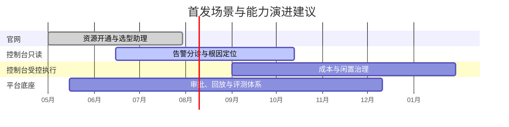
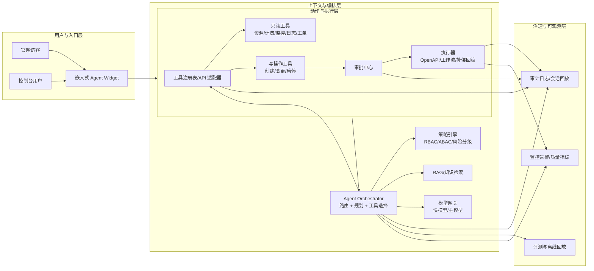

# 优云官网与控制台内嵌 Agent 调研大纲

这项调研适合采用“横纵分析法 + 产品落地框架”，而且必须两者一起用。单独做纵向，只能回答“行业已经走到哪一步”；单独做横向，只能回答“各家现在差在哪里”；真正决定优云该怎么做的，是把两者再和“入口选择、上下文能力、动作边界、权限审批、审计回放、商业闭环”绑定起来。公开资料显示，头部厂商已经不再把这类产品当成单一聊天助手，而是把它做成“入口 + 上下文 + 工具/工作流 + 权限/审批 + 可追溯/运营”的控制平面能力。citeturn29view2turn28view0turn28view1turn28view2turn32view0turn31view5turn37view2turn37view3

行业演进已经明显越过“FAQ 智能客服”阶段，进入“受控执行 + 平台治理”阶段。公开里程碑大致表现为：2023 年底到 2024 年上半年先是控制台问答助手和 agent builder 起步；到 2024 年底到 2025 年，开始出现多智能体、工作流、资源上下文和受限动作执行；到 2025 年下半年到 2026 年，身份、审批、沙箱、威胁检测、BYO 会话存储、长期记忆、Access Transparency 等生产级治理能力开始成为主战场。也就是说，优云若只做“会聊天的官网浮窗”，很难形成真正有用的差异化。citeturn18search0turn16search2turn16search4turn36view0turn36view1turn19search3turn31view6turn37view3

对优云的直接建议是：首发阶段不要追求“全自动跨控制台代操作”，而应优先发布三个高价值、可量化、低风险的能力层级：一是“选型与开通引导”，二是“资源/告警诊断与运维建议”，三是“成本与闲置治理的审批式执行”。所有写操作都应默认经过用户确认，敏感操作再叠加审批和回滚设计；所有回答尽可能给出来源、步骤和可回放证据。这一点在 Google Cloud、Azure、阿里云 OOS、AWS Q Business、腾讯云 ADP 的公开设计里高度一致。citeturn32view0turn10view0turn10view1turn35view3turn38view5turn28view1

## 调研目标与范围

本次调研的目标，不是泛泛比较“谁家 AI 更强”，而是回答一个更具体的问题：**优云是否应该在官网和控制台内嵌一个类似 KiKi 的 agent，以及如果要做，应该先做到什么程度、以什么架构和治理方式推进，才能真正对用户有用。** 从公开产品形态看，entity["company","腾讯云","cloud services china"] 的 KiKi、Google Cloud 的 Gemini Cloud Assist、entity["company","亚马逊云科技","cloud division us"] 的 Amazon Q / Bedrock Agents、entity["company","阿里云","cloud services china"] 的 AI 助理 / OOS AI 助手 / 百炼 Agent 体系，以及 entity["company","微软 Azure","cloud platform us"] 的 Azure Copilot，并不是同一层产品，而是从“入口层助手”到“生产级 agent 平台”的组合。citeturn40view0turn30view0turn34view0turn35view2turn8view1turn10view0turn37view0

这意味着，优云的研究范围必须同时覆盖官网和控制台，但两者的能力上限不应相同。官网更适合承载方案推荐、产品导航、参数预填、转化承接和试用引导；控制台首页更适合承载全局资源问答、成本概览和快捷操作；资源详情页、告警页、账单页才适合注入强上下文，承接诊断、治理和审批式执行。这种“同一大脑、不同入口策略”的分层做法，和 AWS 把 Amazon Q 放在官网、控制台、文档站与移动端，阿里云把 AI 助理放在 aliyun.com 而把 OOS/OSS/Tair 的更强能力放入产品侧边栏，Google 与 Azure 则主要把强能力压在云控制台内部的做法是一致的。citeturn34view0turn8view1turn10view1turn24search4turn7search13turn32view0turn37view1

| 分析框架 | 要回答的问题 | 对优云的产出 |
|---|---|---|
| 纵向分析法 | 行业从“问答助手”演进到“受控执行 agent”经历了什么阶段 | 时间线、能力成熟度、关键里程碑 |
| 横向分析法 | 头部厂商在入口、上下文、执行、治理上差在哪 | 厂商对比表、最佳实践清单 |
| 产品落地框架 | 优云现在能不能做、先做什么、怎么安全地做 | 就绪度评估、风险矩阵、场景优先级、3/6/12 个月路线图 |

本报告将“类似 KiKi 的 agent”定义为满足五个门槛：一是**内嵌入口**，用户不离开官网/控制台即可触发；二是**上下文感知**，至少能感知页面、资源、租户、会话；三是**任务规划**，能把自然语言转成受限工具或流程；四是**动作边界**，写操作必须分级确认；五是**可追溯**，要能复盘回答、参数、审批和执行痕迹。这个定义基本覆盖了 Google Cloud Assist、Azure Copilot、AWS Q Business/Bedrock Agents、阿里云 OOS AI 助手与腾讯云 ADP 公开能力的共同核心。citeturn32view0turn32view1turn37view2turn35view0turn35view3turn10view0turn28view1

## 纵向分析

把官网/控制台 agent 的演进放到时间轴上看，最重要的发现是：**真正的分水岭，不是从“没有 AI”到“有聊天框”，而是从“纯回答”到“带上下文的受控动作”，再到“可治理、可审计、可平台化”。** 这也是为什么横纵分析法对优云是可行的，但必须叠加产品落地框架；因为仅知道行业演进，不足以判断优云是否具备把动作真正落地到控制平面里的组织和工程条件。citeturn18search0turn16search2turn15view1turn36view1turn19search7turn37view4

| 阶段 | 代表里程碑 | 典型能力 | 技术要求 | 治理要求 | 对优云的启示 |
|---|---|---|---|---|---|
| 助手化 | Amazon Q 于 2023-11 预览发布；Gemini for Google Cloud 与 Vertex AI Agent Builder 于 2024-04 发布；阿里云 AI 助理在 aliyun.com 提供知识问答、方案推荐和资源查询。citeturn18search0turn16search2turn16search4turn8view1 | 文档问答、产品解释、命令生成、轻度资源查询 | 文档/RAG、会话存储、入口组件、命令模板 | 明确免责声明，默认只读 | 优云若连“可信回答 + 来源 + 参数预填”都做不好，不宜直接进动作执行阶段 |
| 上下文化 | 腾讯云 2024-07 开始支持调试信息与 traceid，2024-09 支持参考来源回溯；2025-03/04 升级 workflow 与 Multi-Agent；AWS Bedrock 于 2024-12 预览多智能体并于 2025-03 GA；Google 于 2025-04 强化多系统 agents。citeturn15view2turn15view1turn36view0turn36view1turn16search6 | 页面/项目/资源上下文、来源引用、任务拆解、多 Agent/工作流协同 | 资源图谱、工具注册表、session、trace、指标 | 权限感知检索、角色映射、调用痕迹 | 优云的核心挑战将从“模型回答”转向“上下文注入和工具编排” |
| 执行化 | Google Cloud Assist 2025 年开始支持围绕监控告警、漏洞、组织策略等更强场景；阿里云 OOS AI 助手于 2025-10 公布自然语言云运维；Azure Copilot 2025-11 起公开 Agent 模式；腾讯云 2025-12 上线 Widget。citeturn21search5turn10view0turn20search4turn38view3turn38view4turn14view0 | Guided workflow、问题调查、配置建议、预填部署、受限写操作 | 动作白名单、审批钩子、Widget/card 组件、工作流引擎 | 二次确认、策略校验、人工 review | 优云首发阶段应以“有界动作”替代“自由代操作” |
| 平台化 | 腾讯云 2026 年把 Skills、审批中心、云部署、安全网关、Agent 沙箱拼成体系；阿里云在 2026 年把 Agent 2.0 与 Agent Identity 打通；Google 在 Agent Engine 中引入 IAM agent identity、Threat Detection、Access Transparency/Approval 等；Azure 支持 BYO 会话存储；AWS 则在 2025-2026 年强调 decision traces、multi-tenancy、AgentCore。citeturn13view2turn28view1turn28view2turn28view3turn8view2turn19search3turn31view5turn31view6turn37view3turn35view5turn34view9 | 长期记忆、审计回放、多租户治理、生产级运维、安全隔离 | Agent 身份、策略引擎、沙箱、可观测、许可证/云部署 | 数据留存、访问审批、SLA、合规边界 | 优云真正的壁垒不在聊天，而在控制平面治理和可运营能力 |

从优云的角度看，最重要的纵向结论有两个。**第一，KiKi 类能力表面上是交互设计，实质上是控制平面重构。** 没有统一账号、API、权限和审计，这类 agent 最终会退化成“会说话的帮助中心”。**第二，真正有用的 agent 不应一开始追求通用，而应围绕几个高频、标准化、可度量的路径深挖。** 这也是 Google 先在控制台里做 guided workflow，AWS 把控制台助手与企业 action 平台分开，Azure 把 deployment/observability agents 做成边界清晰的专用 agent，阿里云把执行型能力先落到 OOS 的原因。citeturn32view0turn34view0turn35view0turn37view4turn38view4turn10view0

## 横向分析

横向比较时，需要先说明一个方法论限制：**KiKi 的公开官方文档显著少于 ADP、Gemini Cloud Assist、Amazon Q、Azure Copilot 等产品，当前对 KiKi 的能力判断只能用腾讯云开发者社区文章与周边正式文档交叉校验，因此腾讯一行的“KiKi 具体交互与自动执行细节”可信度应标为中等，而不是高。** 不过，腾讯云 ADP、审批中心、安全网关、沙箱、云部署等正式文档已经足以说明其背后的平台拼图。citeturn40view0turn29view2turn28view1turn28view2turn28view3turn23search7

| 厂商 | 主要入口 | 上下文感知 | 任务规划 | 动作执行 | 主要公开依据 |
|---|---|---|---|---|---|
| **entity["company","腾讯云","cloud services china"]** | 公开资料显示 KiKi 位于官网入口；ADP 则支持 Web/API/企业 IM 等多渠道发布 | KiKi 公开描述强调页面上下文与跨页面操作；ADP 具备工作空间、知识库、插件、变量与记忆 | 标准模式、Multi-Agent、Workflow、Plan-and-Execute、Skills、Widget | 社区公开文章描述可完成“一句话部署 OpenClaw”；正式平台侧则通过工具、工作流、沙箱承接动作 | KiKi 社区公开材料 + ADP 正式文档。citeturn40view0turn29view2turn29view3turn15view1turn13view2turn29view0 |
| **entity["company","谷歌云","cloud division us"]** | 控制台右上角 Cloud Assist 面板，可展开为全页 | 对话历史、项目/文件夹级上下文、Cloud Asset/成本/监控/数据库上下文 | Guided workflow、Application Design Center 上下文转移；Agent Engine 提供 session、memory、code execution | 公开资料更偏“建议 + 调查 + 上下文转移”；对强执行动作保持保守 | 控制台文档、Agent Engine 与定价/资源页。citeturn32view0turn32view1turn32view2turn31view4turn31view6turn33view1 |
| **entity["company","亚马逊云科技","cloud division us"]** | Amazon Q 在控制台、官网、文档站、移动端和聊天应用可用 | 可问 AWS 架构/资源/文档；Q Business 返回 permission-aware 响应并带来源 | 控制台侧偏 copilot；强规划主要在 Bedrock Agents、action groups、multi-agent collaboration | 控制台可引导/Console-to-Code/支持工单；企业动作主要通过 Q Business 插件和 Bedrock agents 承接 | Q Developer、Q Business、Bedrock Agents 正式文档。citeturn34view0turn34view1turn35view2turn34view3turn36view1turn35view0 |
| **entity["company","阿里云","cloud services china"]** | aliyun.com 的 AI 助理；OOS/OSS/Tair 等产品内置侧边栏助手；百炼控制台 | 官网侧侧重知识、方案、资源查询；OOS 支持跨地域资源查询；产品侧可 @ 实例增强上下文 | 百炼 Agent 2.0 支持知识库与 MCP 统一成工具，自主规划并显示“规划—执行—反思” | OOS AI 助手支持自然语言查询/监控/操作，默认写操作二次确认；官网 AI 助理更多是咨询与导流 | 官网 AI 助理、OOS、百炼、Agent Identity 正式文档。citeturn8view1turn10view0turn10view1turn8view3turn8view2 |
| **entity["company","微软 Azure","cloud platform us"]** | Azure 门户页眉 Copilot 按钮，全屏模式支持多会话 | 可手动添加资源、订阅、资源组等实体上下文 | Agent mode 下按任务自动调用 deployment/observability 等专用 agents | 可生成 Terraform、创建 GitHub PR、启动调查；目前 observability agent 不直接做 remediation | Azure Copilot 与 agents 预览正式文档。citeturn37view1turn38view2turn37view4turn38view4 |

| 厂商 | 风险控制 | 可追溯 | 治理能力 | 商业化路径 | 判断 |
|---|---|---|---|---|---|
| 腾讯云 | 工作空间隔离、角色权限、审批中心、AI Agent 安全网关、Agent 沙箱 | 早期就支持调试信息与 traceid，后续又加强参考来源与 Widget 交互 | 企业/空间权限、审批规则、云部署版支持客户自有 IaaS 管理 | 免费版、ClawPro、专业版、企业版；PU 计量；另有云部署 License 模式 | **最接近“中国市场想象中的 KiKi 形态”，但 KiKi 本身正式公开文档仍不足，优云不宜只盯它的交互表象，更应看其背后的 ADP 平台化能力。** citeturn28view0turn28view1turn28view2turn28view3turn15view2turn23search0turn23search2turn23search7 |
| Google Cloud | 明确要求校验输出；基于 IAM/API 启用特定上下文能力；Agent Engine 提供 IAM agent identity、Threat Detection、VPC-SC、CMEK、Access Transparency/Approval | 控制台聊天保留历史 180 天；Agent Engine 提供 Trace/Logging/Monitoring/built-in metrics | 项目/文件夹范围、IAM Conditions、数据驻留、SLA | 控制台聊天对所有用户开放；高级能力在预览期与 Code Assist Enterprise 绑定；有专门 SLA 页面 | **最强项在“agent 平台 + 可观测 + 企业控制”，不是“大胆代操作”。** citeturn32view0turn32view1turn31view5turn31view6turn31view7turn33view1turn33view3 |
| AWS | IAM 策略、SCP、least privilege；Q Business 基于 Bedrock 的安全控制；ActionReview 机制要求用户补充/确认字段 | Q Business 强调 source citations；AWS 近期指导明确要求 decision traces 与统一 observability | 控制台与企业动作平台分层，AgentCore/Bedrock/Q Business 各自承担不同边界 | Q Developer Free/Pro；Q Business seat-based；Bedrock/AgentCore 消费式 | **企业动作生态很成熟，但“官网/控制台统一成一个能强执行的内嵌 agent”并不是它的公开主路线。** citeturn34view2turn35view2turn35view3turn35view5turn34view7turn34view8turn34view9 |
| 阿里云 | RAM 角色、默认二次确认；Agent Identity 专门管理 agent 身份与凭证 | 百炼 Agent 2.0 可展示完整“规划—执行—反思”链路；知识库可展示来源 | 网站 AI 助理、产品内助手、百炼平台、Agent Identity 拼接成生态，但入口分散 | 官网 AI 助理未见单独计费；OOS 免费但底层资源收费；百炼模型/知识库按量计费 | **中国本土组件最齐全之一，特别适合作为“执行型能力 + 身份治理”的参考样板。** citeturn10view1turn8view2turn8view3turn24search1turn24search2turn24search8 |
| Azure | 只可访问用户可访问的资源；动作需确认；遵循 Azure RBAC、PIM、Policy、resource locks | 支持 BYO Cosmos DB 存储会话历史并形成租户级审计轨迹；调查过程可显示 reasoning/activity | Global Admin 管理可见性，可给特定用户/组授权；agent mode 与门户控制平面深度融合 | 当前 chat/agent capabilities 无额外收费，agent pricing 未来公布 | **最值得优云借鉴的是“门户 Copilot + 有界专用 agents + 自带治理”的产品切法。** citeturn37view2turn38view5turn37view3turn38view4turn38view0 |

横向上有三个结论最值得优云直接吸收。**第一，真正的差异点不是聊天框，而是动作层是不是 structured。** Google 和 Azure 更强调“用户选实体 + agent 生成方案/调查 + 必要时确认”，AWS 更强调“把动作封装成插件/action group”，阿里云和腾讯云的公开中国案例则更敢把自然语言直接接到资源操作，但都加了二次确认、审批或角色边界。citeturn32view1turn35view0turn10view1turn38view5turn28view1

**第二，所有成熟路线都在把“agent”做成平台，而不是某个点功能。** 腾讯云把 ADP、审批中心、安全网关、沙箱、云部署拼在一起；Google 把 Cloud Assist 与 Agent Engine、Trace、Monitoring、IAM identity 拼在一起；阿里云开始把 Agent Identity 独立出来；Azure 把 access management 与 BYO storage 做进门户；AWS 则用 Prescriptive Guidance 明确提出 multi-tenancy、decision traces 与统一集成层。换言之，优云如果只做前台，没有后端控制平面，后续很难扩展。citeturn28view1turn28view2turn28view3turn31view5turn31view7turn8view2turn37view2turn37view3turn35view5

## 落地评估

由于题设没有给出优云的现有技术细节，以下评估采用**保守假设**：优云已经具备统一账号体系、基础 RBAC、部分 OpenAPI、基础审计和控制台，但尚未形成 agent 专用的动作注册、审批编排、会话回放、模型治理与跨产品标准化流程。这种评估方式参考了腾讯云的工作空间/审批模型、Google 的 IAM 与 Agent Engine 治理、Azure 的访问管理和会话存储、AWS 的 least privilege 与 ActionReview、阿里云的 Agent Identity 与 OOS 二次确认等公开能力。citeturn28view0turn28view1turn31view5turn37view2turn37view3turn34view2turn35view3turn8view2turn10view1

| 能力底座 | 直接支撑的 Agent 能力 | 缺省信息下的保守判断 | 主要风险 | 建议优先级 |
|---|---|---|---|---|
| 统一账号体系与租户边界 | 用户身份映射、资源可见性、会话归属 | **部分支撑**：大概率已有，但是否支持项目/组织/子账号多级作用域未知 | 会出现“能看到不该看的资源”或“看不到应看到的资源” | P0 |
| OpenAPI 覆盖与幂等性 | 创建、启停、查询、变更等动作落地 | **高风险未知**：如果只覆盖核心资源、长尾产品不足，agent 会频繁掉回人工 | “会建议、不会做”；或写操作不可回滚 | P0 |
| 权限模型 | 只读/低风险写/高风险写分级 | **部分支撑**：若只有粗粒度 RBAC，不足以支撑 agent | 容易出现越权或过度保守 | P0 |
| 审计与回放 | 回答复盘、执行留痕、合规取证 | **偏弱**：传统审计常记录 API，不记录“提示词—上下文—审批—结果”链路 | 出问题后无法定位责任与原因 | P0 |
| 控制台流程标准化 | 参数澄清、表单预填、跨页跳转、Widget 展示 | **中等**：核心流程大概率标准化，长尾流程通常不统一 | agent 无法稳定引导用户走完流程 | P1 |
| 运维与回滚能力 | 有界执行、失败恢复、草案/Dry-run | **偏弱到未知** | 写操作出错后只能人工擦屁股 | P0 |
| 计费、配额、库存与资产图谱 | 成本优化、闲置治理、容量建议 | **中等到未知** | 成本优化建议缺数据或误判 | P1 |
| 日志、指标、告警、变更事件接口 | 告警分诊、根因定位、异常解释 | **中等到未知** | 只能给泛化建议，不能真的定位问题 | P1 |
| 知识与文档治理 | 可信答案、来源引用、产品说明一致性 | **部分支撑** | 幻觉、版本不一致、文档过期 | P1 |
| 数据合规与留存边界 | 会话存储、模型调用、审计留存 | **高风险未知** | 跨境、留存、个人信息等合规问题 | P0 |

| 风险项 | 概率 | 影响 | 触发条件 | 缓解策略 | 优先级 |
|---|---|---|---|---|---|
| 越权执行 | 中高 | 极高 | 用户权限与 agent 工具权限映射不清 | 基于用户权限实时签发短期 delegated token；动作前权限复核；高风险操作强制审批 | P0 |
| 幻觉导致错误建议或错误参数 | 高 | 高 | 文档不一致、上下文缺失、模型不确定 | 所有关键答案要求来源引用；写操作必须先生成计划草案；高风险参数只允许从结构化表单取值 | P0 |
| API 不完整或不幂等 | 高 | 高 | 长尾产品无 OpenAPI、接口无 dry-run/rollback | 建立 action registry，只对白名单动作开放；优先做只读和预填，不做 browser RPA | P0 |
| 回滚缺失 | 中 | 极高 | 批量治理、资源启停、配置变更失败 | 每个写动作必须有回滚模板、补偿流或人工 Runbook | P0 |
| 长尾控制台流程不标准 | 高 | 中 | 同类产品表单和校验规则不一致 | 先只覆盖 Top 20 用户旅程；其余场景输出“指引卡 + 深链跳转” | P1 |
| 成本失控 | 中 | 高 | 大模型滥用、工具调用链过长、日志无限留存 | 快慢模型路由、配额、缓存、prompt budget、灰度开关 | P1 |
| 合规与数据驻留风险 | 中 | 高 | 会话跨境、提示词含敏感数据、审计留存不当 | 会话分级、敏感数据脱敏、私有部署/专有云选项、留存策略可配置 | P0 |
| 用户信任受损 | 中高 | 高 | agent “擅自做主”或看起来在黑盒操作 | 所有执行步骤显式展示；允许随时叫停；默认返回“计划—确认—执行”三段式 | P0 |

完成后续深调研前，优云至少需要补充以下十个关键数据点；否则落地评估只能停留在保守假设层面。

| 需要优云补充的数据点 | 为什么关键 |
|---|---|
| 统一账号/组织/项目/子账号模型 | 决定 agent 如何继承用户可见性和作用域 |
| 当前 RBAC/ABAC/JIT/PIM 能力 | 决定敏感动作能否安全授权 |
| 核心产品 OpenAPI 覆盖率与幂等性 | 决定能否从“建议”走到“执行” |
| Top 20 控制台用户旅程是否已有标准化 schema | 决定参数澄清和表单预填是否可做 |
| 审计日志字段与保留时长 | 决定能否做会话回放和事故复盘 |
| 监控/日志/告警/变更事件的 API 能力 | 决定诊断型 agent 上限 |
| 计费、预算、配额、资产 inventory 接口 | 决定成本治理是否可信 |
| 变更执行与回滚/补偿现状 | 决定写操作是否可灰度开放 |
| 文档库/知识库的版本机制与更新频率 | 决定回答准确性与来源可靠性 |
| 数据合规要求与模型部署边界 | 决定是否需要私有化、专有云或分区部署 |

## 首发场景与价值验证

首发场景选择的原则应是：**高频、标准化、数据可得、风险可控、效果可量化。** 在这一点上，腾讯 KiKi 的“一句话部署”、Google 的 guided workflow、Azure 的 deployment agent、阿里云 OOS 的自然语言运维、AWS 的插件动作都说明，真正让用户感到“有用”的，不是它能聊得多像人，而是它能不能替用户减少跨页面跳转、降低参数输入成本、缩短诊断和决策时间。citeturn40view0turn32view0turn37view4turn10view0turn35view0

| 首发场景 | 为什么值得先做 | 具体任务流程 | 用户确认点 | 成功指标 | 失败回退 | 实现难度 | 用户价值 |
|---|---|---|---|---|---|---|---|
| 资源开通与选型助理 | 官网与控制台都能承接，直接影响转化率与首单体验；对应 KiKi、Cloud Assist、Azure deployment 的公开路径。citeturn40view0turn31view1turn37view4 | 用户输入目标，如“我要做一个面向东南亚的小型官网，预算 3000 元/月”；agent 追问地域、备案、峰值流量、容灾要求；输出“推荐架构卡 + 月成本估算 + 预填创建页/购物车草案”；用户跳转到已预填页面完成下单 | 支付、规格、地域、网络、安全组等关键参数必须由用户确认 | 咨询到创建页转化率、参数填写时长、放弃率、首单成功率 | 生成可下载方案、导到产品对比页、转人工售前 | 中 | 高 |
| 告警分诊与根因定位助理 | 最大幅度减少“看不懂告警—不会排查—要找人工”的时延；Google、Azure、阿里云 OOS 都在公开资料里强化了这一类能力。citeturn21search5turn38view4turn10view0 | 用户位于告警页点击“帮我分析”；agent 自动读取资源、近 1 小时指标、近 24 小时配置变更、相关日志和 Runbook；输出“最可能原因、证据、建议动作、是否创建工单/调查单” | 创建工单、执行诊断脚本、推送通知等外部动作需确认 | 平均定位时长、建议采纳率、误报率、支持工单转人工率、问题一次解决率 | 降级为“证据包 + Runbook + 人工支持入口” | 中高 | 很高 |
| 成本与闲置治理助理 | ROI 最容易量化；Google Cloud Assist 和阿里云 OOS 的公开能力都已把成本/闲置资源作为重要切点。citeturn32view1turn10view1 | 用户输入“找出最近 14 天闲置资源并给我一个节省方案”；agent 汇总 inventory、利用率、账单、配额，输出“建议清单 + 节省金额 + 风险标签”；用户勾选对象后，agent 生成审批单或治理计划，审批通过后执行 | 停机、释放、降配、预算调整等动作必须走确认；高风险对象二次审批 | 建议采纳率、月度节省金额、误伤率、审批通过率、执行成功率 | 只导出清单、创建治理工单、不直接执行 | 中 | 很高 |

如果一定要把这三个场景再压缩成一句产品策略，那应该是：**官网先做“更懂业务目标的转化助手”，控制台先做“更懂资源上下文的诊断助手”，直到审批、回滚、审计都成熟后，再做“更懂边界的执行助手”。** 这是比直接复制 KiKi 更稳、更适合优云现阶段的方法。citeturn40view0turn32view0turn38view5turn10view1turn35view3

## 技术路线与架构要点

技术路线最需要避免的误区，是把“会话界面”当成核心。对优云来说，核心不是前端聊天框，而是**Agent Control Plane**：它要把模型、RAG、工具调用、审批、审计、身份、回滚和观测变成一套可控的中台。公开产品里已经反复证明，只有这样，agent 才能从单点演示走向生产。腾讯云把技能、审批、安全网关、沙箱和云部署都收束到平台侧；Google 把会话、memory、IAM agent identity、logging/monitoring 收束到 Agent Engine；Azure 也通过门户 access management 和会话存储把治理做进控制面。citeturn28view1turn28view2turn28view3turn31view5turn31view6turn31view7turn37view2turn37view3

| 能力层 | 目标 | 推荐开源组件 | 商用/自研建议 |
|---|---|---|---|
| 模型与路由层 | 区分便宜快模型与高推理主模型，控制延迟与成本 | vLLM、LiteLLM、TGI | 自研模型网关，统一接入国产/外部模型 |
| RAG 与知识层 | 统一官网文档、产品文档、Runbook、FAQ、计费规则、公告 | OpenSearch/Elasticsearch、pgvector/Milvus、Docling/Unstructured | 官网内容与控制台知识分库，强制版本标记与来源返回 |
| 编排与 Agent Runtime | 把自然语言变成“计划—工具—结果” | LangGraph、Temporal、OpenTelemetry | 快速验证可用轻量编排；生产建议自研 Orchestrator + 工作流引擎 |
| 工具与动作注册表 | 统一接入 OpenAPI、工单、监控、CMDB、计费系统 | MCP Server、Kong/APISIX、JSON Schema | 强烈建议自建 action registry，不直接让模型自由拼 API |
| 审批与回滚层 | 给风险操作加“确认—审批—执行—补偿” | Flowable、Camunda、Argo Workflows | 若优云已有审批中心，应先复用；无则单独建设 agent 审批流 |
| 身份与权限层 | 让 agent 以“用户代理”而非“超级账号”行事 | OPA/Casbin、Keycloak | 最好采用短期 token + 细粒度 scope，不复用长期主账号凭证 |
| 审计与观测层 | 记录提示词、上下文、工具调用、审批、结果、耗时 | OpenTelemetry、Tempo/Jaeger、Loki/ELK、Prometheus/Grafana | 审计要能“按对话回放”，而不是只看 API success/fail |
| 表现层 | 用卡片/Widget 承载确认、来源、参数收集、结果展示 | React 组件库、JSON Schema Form | 不建议长期停留在纯文本，复杂输出必须卡片化 |

这套架构背后的关键设计原则只有三条。其一，**优先结构化工具，而不是 browser RPA**；其二，**默认计划草案和用户确认先于执行**；其三，**任何高风险动作都要能“解释自己为什么这么做”。** 这些原则在 AWS 的 ActionReview、Azure 的 confirmation、阿里云 OOS 的二次确认、腾讯云的审批中心和安全网关中都能找到明确映射。citeturn35view3turn38view5turn10view1turn28view1turn28view2

## 治理与运营建议

治理上，优云最应该学到的一点是：**agent 不应被当成一个“会聊天的前端功能”，而应被当成一个“拥有身份、权限、成本、责任边界的数字操作者”。** AWS 最近的官方指导甚至直接建议把 agents 当成长期存在的服务主体来管理，要求有独立身份、权限、升级和可观测体系；阿里云则把 Agent Identity 独立成平台基础服务；Google、Azure 和腾讯云都把权限与治理能力收束到控制平面。citeturn35view5turn8view2turn31view5turn37view2turn28view0

| 治理域 | 建议 | 落地要点 |
|---|---|---|
| 身份与权限 | agent 永远不要继承“全量主账号权限” | 以用户为主体签发短时代理令牌；只给最小权限 scope；高危能力需 JIT 授权 |
| 敏感操作审批 | 把动作按风险分成只读、低风险写、高风险写 | 低风险写至少二次确认；高风险写必须审批；关停/释放/安全策略变更需 4-eyes 原则 |
| 审计与回放 | 建立“对话级”审计，而不是只有“接口级”审计 | 保存 prompt、上下文摘要、工具参数、审批人、执行结果、trace id、回滚信息 |
| 模型与提示治理 | 把 prompt 当成代码，把 agent 版本当成发布物 | 建立版本库、灰度发布、A/B 测试、离线评测集、回归测试 |
| 异常与人工接管 | 允许 agent 在不确定时自然退让 | 低置信度、权限不足、API 失败、风险超阈值时自动转人工/工单 |
| SLA 与监控 | 同时看体验、效果和风险 | 监控 p95 延迟、任务成功率、引用率、审批通过率、误执行率、回滚成功率 |
| 上线运营策略 | 先灰度只读，再开放有界执行 | 内部体验 → 白名单客户 → 默认启用只读 → 限域开放写操作 → 更多产品接入 |

| 指标组 | 建议首期指标 |
|---|---|
| 体验指标 | 简单问答首响应 p95 ≤ 3 秒；复杂诊断结果 p95 ≤ 20 秒 |
| 效果指标 | 首发场景任务成功率 ≥ 70%；用户采纳率 ≥ 30% |
| 安全指标 | 越权调用拦截率、敏感动作审批覆盖率、未确认执行数必须为 0 |
| 可信指标 | 关键答案来源引用覆盖率 ≥ 80%；高风险建议人工抽检通过率 ≥ 95% |
| 运维指标 | Action API 成功率 ≥ 99%；回滚成功率 ≥ 95%；审计日志丢失率 = 0 |
| 商业指标 | 咨询到创建转化率、工单转人工下降率、月度节省金额、活跃用户渗透率 |

运营上不建议一开始就把 agent 包成“万能助手”。更好的叙事是：**第一阶段是帮你更快找到答案和入口，第二阶段是帮你更快做出判断，第三阶段才是帮你在确认后执行。** 这能显著降低用户对“AI 擅自做主”的反感，也更符合云控制台的风险特征。citeturn32view0turn37view2turn10view1turn28view1

## 里程碑与资源配置

从执行节奏看，优云最合理的路线不是“大而全立项”，而是用 3、6、12 个月三个台阶逐渐把“咨询能力”推进到“可治理的执行能力”。这样的阶段划分与公开厂商的成熟路径一致：先入口与问答，再上下文与工作流，再审批和平台治理。citeturn15view2turn36view1turn19search7turn37view4

| 时间点 | 执行优先级 | 业务交付 | 技术交付 | 治理交付 | 退出标准 |
|---|---|---|---|---|---|
| 3 个月 | P0 | 官网/控制台统一入口；资源开通与选型助理 MVP；控制台只读问答与来源引用 | 上下文注入、知识检索、深链跳转、参数预填、基础 action registry、Widget v1 | 会话审计 v1、只读白名单、模型版本管理、基础灰度开关 | 首发场景内测可用；关键答案引用率达标；无越权执行 |
| 6 个月 | P0/P1 | 告警分诊与根因定位上线；成本与闲置治理生成审批草案 | 指标/日志/变更事件接入；审批工作流；计划草案—确认—执行链路；回滚模板 | 动作分级、审批策略、离线评测、人工接管闭环 | 诊断类任务成功率稳定；审批式动作可控；用户满意度形成正反馈 |
| 12 个月 | P1/P2 | 多产品扩展；受限写操作覆盖核心云产品；个性化工作空间助理 | 多 agent/工作流协同；长期记忆可选；专有云/私有部署选项；运营面板 | 租户级回放、合规留存配置、成本治理、SLA 机制 | 形成“可卖、可运维、可审计”的产品级 agent 能力 |

| 团队角色 | 3 个月建议投入 | 6-12 个月建议投入 | 主要职责 |
|---|---|---|---|
| 产品负责人 | 1 FTE | 1 FTE | 场景优先级、指标、版本策略 |
| 设计/UX | 1 FTE | 1 FTE | 对话 + Widget + 确认链路设计 |
| 前端工程 | 2 FTE | 2-3 FTE | 官网/控制台嵌入、组件化 UI |
| 控制台后端/平台工程 | 2-3 FTE | 3-4 FTE | 上下文服务、action registry、深链/预填 |
| Agent/LLM 工程 | 2 FTE | 2-3 FTE | 编排、prompt、模型路由、评测 |
| RAG/知识工程 | 1 FTE | 1-2 FTE | 文档治理、知识索引、来源追溯 |
| IAM/安全工程 | 1 FTE | 1-2 FTE | 代理权限、审批、审计、风控 |
| SRE/QA | 1-2 FTE | 2 FTE | 可靠性、回滚、压测、质量保障 |
| 数据分析/运营 | 0.5-1 FTE | 1 FTE | 采纳率、转化率、ROI、实验分析 |

按这个口径，**优云首期较可行的资源配置大约是 10.5 到 13 FTE，进入 6-12 个月扩展期后上升到 13 到 17 FTE。** 如果优云现有控制台平台、审批中台、IAM 中台和运维链路成熟，实际新增投入可以更低；如果这些能力尚未沉淀，真正的工程量会主要出现在中台而不是模型接入层。这个判断与头部厂商公开能力呈现出的结构是一致的：前台 assistant 只是冰山一角，后台控制平面才是主体。citeturn28view0turn28view1turn31view5turn37view2turn35view5