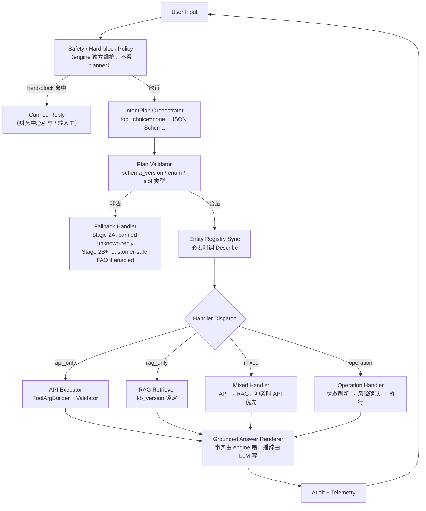

# Stage 2A → 2D 设计基线：IntentPlan + 确定性执行 + 分级知识

## 0. 这份文档是什么

本文档是 compshare-agent 从 stage 1（10-step 资源信息 E2E 通过、7+ 关键词 guard 堆叠）走向 stage 2（**编排层 + 确定性工具层 + 分级知识层 + 安全治理层**）的 **设计基线**。所有后续代码改动须先匹配本文档定义的契约。

文档不写实现细节，只写**契约、边界、验收标准、迁移路径**。实现工单按本文档 §11 的 stage 切分单独开。

## 1. 北极星定位：workflow with LLM steps，不是 autonomous agent

参照 [Anthropic Building Effective Agents](https://www.anthropic.com/engineering/building-effective-agents) 的区分：

- **workflow**：步骤可枚举、流转条件可判定、调用顺序可预测，LLM 负责其中需要语言理解的子步骤
- **autonomous agent**：LLM 自由决定下一步动作、循环退出条件、工具组合

compshare-agent 是**前者**。当出现"LLM 主导"还是"engine 主导"的设计冲突时，按下面优先级裁决：

```
可预测 > 可审计 > 可回滚 > 可解释 > 灵活性
```

具体含义：
- 任何**业务动作**（API 调用、参数构造、工具选择）由 engine 决定
- 任何**实体引用**（UHostId / ProjectId / Zone / Region）由 engine 从 EntityRegistry 解析
- 任何**数值判断**（最大值、最小值、排序、阈值告警、合计）由 engine 计算
- LLM 只负责：**意图理解、slot 抽取、自然语言措辞、表格排版**

工业界对照：AWS Bedrock Agents 把 `action groups` / `knowledge bases` 显式分开；Microsoft Copilot Studio 强调工具描述精确化、参数白名单；Google Dialogflow Playbook 要求"无工具结果时不能编"——本架构将这些原则落到代码契约。

## 2. 架构总览



七个核心模块按职责清晰拆分。**EntityRegistry 在本图里是**核心节点**，不是附属——它是 §6 所有 ToolArgBuilder 的唯一可信源。

## 3. 核心模块契约

### 3.1 IntentPlan Orchestrator

**职责**：把用户原文 + 上下文摘要翻译成结构化计划 JSON。

**禁止**：
- **不得生成未在用户当轮原文 / 引用的历史对话片段中逐字出现的实体 ID**（`uhost-xxx` / `ep-xxx` / `proj-xxx` / region 字符串等）。用户**显式输入**的 ID **可以**作为 `uhost_id_user_input` 类 target_ref 输出，但必须带 `source` + `source_span`，且 EntityValidator（§3.3）会对 `source_span` 在用户原文里 substring 校验，校验失败即视为 attempted hallucination 拦截。
- 决定是否触发 hard-block —— hard-block 由 §3.9 独立判定
- 输出 free-form 文本（除 `reasoning` 字段，且不进入 engine 决策）

**输入**：
- 用户当前 message
- 最近 N 轮 messages 摘要（N=3，防止超 token）
- 当前 EntityRegistry 摘要（§3.2 输出的 compact 表）
- 系统时间（Beijing wall-clock）

**输出 schema v1.0**：

```json
{
  "schema_version": "1.0",
  "intent": "monitor_query",
  "scope": "running_instances",
  "slots": {
    "target_refs": [
      {"type": "filter", "value": "all_running", "source": "user_text"},
      {"type": "name", "value": "wyp-test", "source": "user_text", "source_span": "看 wyp-test 那台"},
      {"type": "uhost_id_user_input", "value": "uhost-xxxx", "source": "user_text", "source_span": "uhost-xxxx"}
    ],
    "metrics": ["cpu", "memory", "gpu", "vram"],
    "time_window": {"type": "preset", "value": "last_60s"}
  },
  "required_tools": ["DescribeCompShareInstance", "GetCompShareInstanceMonitor"],
  "retrieval": {"enabled": false},
  "hard_block_hint": false,
  "confidence": 0.92,
  "reasoning": "用户要看运行中机器的实时监控，只需多实例 60 秒快照"
}
```

**意图 enum v1.0（14 个）**：

```
monitor_query | monitor_history | resource_info | billing_instance |
billing_account_unsupported | expiry_renewal | diagnosis | vague_failure |
operation_lifecycle | recommendation | knowledge_qa | mixed_diagnosis_kb |
mixed_billing_kb | unknown
```

**slot.target_refs 的 type 枚举**：
- `filter`：`all` / `all_running` / `all_stopped` / `gpu_type=4090`
- `name`：实例名（engine 在 registry 模糊匹配）
- `uhost_id_user_input`：用户原文输入的 ID（engine 必须对照 registry 验真）
- `slot_position`：`first_running` / `last_mentioned`（指代消解）

**target_ref 必填 provenance 字段**：

每个非 `filter` / `slot_position` 类型的 target_ref 必须带：
- `source`：`user_text`（来自用户当轮原话）/ `prior_turn`（来自历史对话引用）/ `registry_resolved`（不出现在 planner 输出，仅 engine 内部使用）
- `source_span`：在用户原话或引用历史里**字面出现的片段**（≤ 50 字符），EntityValidator 必须能 substring 匹配回去

**关键约束**：
- LLM 永远不出 `"uhost_id_planner_generated": "..."` 这种字段。在 IntentPlan 的 system prompt 强制 + JSON Schema enum 限定。
- 任何 `uhost_id_user_input` 类型的 target_ref，若 `source_span` 在用户原文里 substring 匹配失败，EntityValidator 必须**拒绝**该引用并标记 `attempted_hallucinated_entity`。这是防 planner 自己捏造一个看似"用户输入"的 ID。

### 3.1.1 Provider Capability Fallback

不同 LLM provider 对结构化输出的支持程度不同。planner 调用按下表降级：

| 优先级 | 模式 | 支持情况 |
|:-:|---|---|
| 1 | `response_format: {"type": "json_schema", "schema": ...}` | OpenAI gpt-4o+ / Anthropic 部分新版本 / Modelverse 部分模型 |
| 2 | `response_format: {"type": "json_object"}` | OpenAI 多数模型 / 部分国产模型 |
| 3 | 普通 prompt + 严格 JSON 输出指令，engine 端 parse + 1 次 retry | 通用兜底 |
| 4 | 上面全失败 → unknown intent fallback（见 §5） | — |

**额外约束**：planner 模型如果是 thinking-mode（如 Doubao Lite via Modelverse 默认开 thinking），优先选 mode 2 或 3，因为 thinking trace 容易污染 mode 1 的 schema 校验。能力表写在 `internal/llm/capability.go`，按 `(base_url, model)` 元组查询。

### 3.2 EntityRegistry（核心模块）

**职责**：本会话内所有真实实体的唯一权威源。

**结构**：

```go
type EntityRegistry struct {
    Instances     map[string]InstanceSnapshot // key = UHostId
    NameIndex     map[string][]string         // key = Name, value = matching UHostIds
    LastFullSync  time.Time
    LastSyncEvent string  // "init" / "describe_success" / "operation_invalidate" / ...
}

type InstanceSnapshot struct {
    UHostId       string
    Name          string
    State         string
    OsType        string
    GPU           int
    GpuType       string
    ImageType     string
    StartTime     int64
    ExpireTime    int64
    AutoRenew     string
    ChargeType    string
    MonitorMessages map[string]any
    // 其它字段按需扩
}
```

**TTL / 失效策略**：

按"是否参与本轮回答"分两档，关键差异在 stale 时是 **sync** 还是 **async** 刷新：

| 场景 | 行为 |
|---|---|
| 初始化（`Init()`） | 强制 sync 一次；失败则不进入主流程，回 "暂时无法访问平台" |
| **API-grounded 意图本轮要回答**（`monitor_*` / `billing_instance` / `resource_info` / `expiry_renewal` / `diagnosis` 等以实时事实为依据的意图） | registry age > 30s 时**同步 sync**；sync 失败则**拒绝实例级回答**，绝不基于过期 registry 构造 args |
| 写类工具（开/关/重启/释放/续费/改名） | 调用前强制 sync，调用后立即 sync |
| 后台预热（如下一轮可能用到） | 允许 async refresh，但**绝不允许在本轮 handler 用未刷新的 snapshot 构造 args** |
| 用户明示"刷新一下" | "refresh_request" 事件 → 强制 sync |

**核心约束**：handler 构造 tool args 时拿到的 registry snapshot 必须满足 `age <= 30s OR sync_event == "just_refreshed_for_this_turn"`，否则 ToolArgBuilder 拒绝构造。这条防"过期 registry 解析出已释放实例 → 调监控 → 空数据 → 错误叙述"的链路。

**对外只暴露 3 个方法**：

```go
ResolveByID(id string) (*InstanceSnapshot, ResolveResult)
// ResolveResult: HIT / NOT_FOUND_IN_ACCOUNT / RECENTLY_RELEASED_GUESS

ResolveByName(name string) ([]*InstanceSnapshot, ResolveResult)
// 多匹配返回 AMBIGUOUS，由调用方追问

Filter(criteria FilterSpec) []*InstanceSnapshot
// criteria: state="Running" / gpu_type="4090" / 等
```

**禁止**：任何 handler 直接读 `e.executor.Execute("DescribeCompShareInstance", ...)` 的返回拼参数；必须经 registry。

### 3.3 EntityValidator（核心模块）

**职责**：在 ToolArgBuilder 输出送入 executor 之前，强制核对每个实体引用。

**校验规则**：

```
foreach UHostIds[i] in tool args:
    resolve = registry.ResolveByID(UHostIds[i])
    case resolve:
        HIT                          -> 通过
        NOT_FOUND_IN_ACCOUNT         -> 阻断 + 标记 escaped_hallucinated_attempt
        RECENTLY_RELEASED_GUESS      -> 阻断 + 用户友好回复
```

**两个独立指标**：

```
attempted_hallucinated_entity_rate
  = (planner 输出 + LLM 自由生成里出现的非真实 ID) / 总 entity 引用
  目标：≤ 1%（用以评估 planner 与 LLM 实体保真度）

escaped_hallucinated_entity_rate
  = 实际进入 executor / renderer 的非真实 ID 数 / 总 entity 引用
  目标：== 0（硬要求，validator 不允许漏）
```

任何 escaped 事件触发 P1 alert + audit 留痕。

### 3.4 ToolArgBuilder

**职责**：把 IntentPlan 的 `slots` + EntityRegistry 状态 → 具体工具的 args dict。

**约束**：
- 永远不从 IntentPlan 直接读 `uhost_id` 字符串塞入 args
- 通过 `slot.target_refs` + registry 解析得到 `[]string` UHostIds
- 时间窗口处理（StartTime/EndTime）：`time_window` 是 enum / relative / absolute，由 builder 转成 Unix 时间戳，**不让 LLM 自己算**

**示例**：

```go
// IntentPlan slots
slots = {
    target_refs: [{type:"filter", value:"all_running"}],
    time_window: {type:"preset", value:"last_60s"},
    metrics: ["cpu", "memory", "gpu", "vram"],
}

// ToolArgBuilder 输出
{
    "Action": "GetCompShareInstanceMonitor",
    "UHostIds": ["uhost-1q433xbj8min", "uhost-1q430ik2vu0o", ...], // 来自 registry.Filter(state="Running")
    // 不传 StartTime/EndTime，触发 60 秒快照
}
```

### 3.5 API Executor + SafeToolExecutor 包装

API 调用拆成两层：

**3.5.1 低层 API Executor**
继续由 `internal/tools/external.go` 承担：HTTP / 签名 / 结果规范化（响应 JSON parse + RetCode 检查）。**当前实现没有重试 / backoff 逻辑**，stage 2A 不在低层加。

重试 / backoff / 熔断这一类**网络可靠性能力归属 SafeToolExecutor**（§3.5.2），按 ToolExecutionPolicy 区分：
- `read_cheap` / `read_expensive_*`：允许至多 1 次重试，仅对网络错误（EOF / connection reset / 5xx）触发，不重试 4xx
- `mutating`：**绝不**自动重试（避免重复执行变更），错误直接上抛
- `destructive`：N/A（stage 2A 拒绝执行）

**3.5.2 SafeToolExecutor（新建，stage 2A 必须实装）**
所有 handler 调用工具**必须经此层**，绝不允许直接调 `tools.Execute`。它继承当前 `engine.executeTool` 里散落的安全语义并显式化：

```go
type ToolExecutionPolicy struct {
    Action          string
    Class           ActionClass      // read_cheap / read_expensive_default / read_expensive_per_target / mutating / destructive
    SecurityLevel   security.Level   // L0=查询/L1=变更需确认/L2=删除拒绝
    NeedsConfirm    bool             // L1 时由用户 confirm
    AllowedParams   []string         // filterAllowedParams 白名单
    RedactInResult  []string         // sanitizer 在送回 LLM 前要脱敏的字段
    DualChannelDisplay bool          // raw token / SSH command 等敏感数据走独立显示通道
    HistoryMonitorGuard bool         // monitor 历史时间窗 guard（继承现有 engine.guardMonitorTemporal*）
    MaxRetries      int              // 0=不重试；read 类默认 1；mutating/destructive 必须 0
    RetryOn         []ErrorClass     // network / 5xx / eof；4xx 永不重试
}

type SafeToolExecutor struct {
    inner    tools.ToolExecutor
    policies map[string]ToolExecutionPolicy
    confirm  ConfirmFunc
    sanitizer *sanitizer.Sanitizer
}

func (s *SafeToolExecutor) Execute(ctx, action, args) (Result, error) {
    p := s.policies[action]
    // 1. 安全等级检查（L2 直接拒）
    if err := security.Check(action, p.SecurityLevel); err != nil { return nil, err }
    // 2. 参数白名单（filterAllowedParams 当前行为）
    args = filterAllowedParams(args, p.AllowedParams)
    // 3. EntityValidator 校验所有实体引用
    if err := entity.Validate(args); err != nil { return nil, err }
    // 4. L1 用户确认
    if p.NeedsConfirm && !s.confirm(action, args) { return nil, ErrUserDeclined }
    // 5. 实际调用
    raw, err := s.inner.Execute(ctx, action, args)
    if err != nil { return nil, err }
    // 6. 历史监控 guard（继承 trackMonitorResult / guardMonitorTemporalFinalReply 当前能力）
    raw = applyHistoryGuard(p, raw)
    // 7. sanitizer 脱敏（密码 / SSH 命令 / 余额数字 等不能进 renderer context）
    redacted := s.sanitizer.Redact(raw, p.RedactInResult)
    return redacted, nil
}
```

**禁止**：handler 绕过 SafeToolExecutor 直接调 inner executor。code review 必须显式 reject 这种写法。

**Policy 注册**：每个 Action 一条 Policy，集中放在 `internal/tools/policies.go`，**不允许** handler 内联覆盖。新增工具时同步注册 policy 是 review checklist 项。

**迁移映射**：当前 `engine.executeTool` 里的 `security.Check` / L1 confirm / `filterAllowedParams` / sanitizer / monitor history guard / dual-channel display 全部迁入 SafeToolExecutor，stage 2A Phase 0 完成此抽离。

### 3.6 RAG Retriever

**职责**：基于 IntentPlan.retrieval 中的 query + source_priority 拉知识 chunk。

**chunk 元数据 schema**：

```json
{
  "chunk_id": "...",
  "kb_version": "kb-2026-04-30-001",
  "source_type": "api_doc | runbook | faq | ops_chat",
  "product_area": "monitor | billing | instance | image | network",
  "valid_from": "2026-04-01",
  "valid_to": null,
  "confidence": "high | medium | low",
  "acl": "internal | customer_safe",
  "source_url_or_thread_id": "...",
  "last_verified_at": "2026-05-01",
  "content": "..."
}
```

**优先级与降级**：
- planner 给的 `source_priority` 是顺序数组
- 每条 chunk 按 priority + similarity 排序
- 低于 similarity 阈值（默认 0.7）的 chunk 直接丢
- 检索结果空 → 不二次扩展，直接返回 `EMPTY` 给 Mixed Handler

**KB 版本化（Zendesk 双索引模式）**：
- 同时维护两套索引 `kb-stable` / `kb-staging`
- 切换通过原子 swap，**绝不**直接 mutate stable
- 每次 retrieval 把命中 chunks 的 `kb_version` 一并返回，audit log 留存

### 3.7 Mixed Handler（最复杂）

**职责**：处理 `mixed_diagnosis_kb` / `mixed_billing_kb` 这类需要"实时事实 + 经验知识"组合的意图。

**失败矩阵（必须显式实现）**：

| API 调用 | RAG 检索 | Renderer 行为 |
|:---:|:---:|---|
| 成功 | 命中 | 用 API 事实 + RAG 解释，回答里**双源标注** |
| 成功 | 未命中 | 仅用 API 事实回答，标 "未检索到知识" |
| 失败 | 命中 | 降级措辞 "暂时无法访问平台，按 runbook 经验是..." |
| 失败 | 未命中 | "我暂时无法回答" + 引导（控制台 / 运维群） |
| 成功 | 命中且与 API 冲突 | **永远以 API 为准**，conflict 打 telemetry，audit 标 `kb_conflict` |

冲突示例：API 显示某实例 `State=Running`，RAG 命中"该型号实例不可用"——以 API 为准。

### 3.8 Grounded Answer Renderer

**职责**：把 engine 准备好的事实 + 知识 + 关键计算结果 → 自然语言回答。

**严格契约**：
- 输入是结构化的 `RenderContext`，包含已计算好的字段：
  ```go
  type RenderContext struct {
      Intent string
      Facts  []Fact          // 来自 API
      Knowledge []KBChunk    // 来自 RAG
      Computed map[string]any // engine 算好的：top_gpu_util_instance / total_cost / threshold_violations
      AttributionMode string // "api_only" / "kb_only" / "mixed_dual_source" / "kb_low_confidence"
  }
  ```
- LLM 拿到这个 context **不允许**：
  - 自己算 max/min/sum/sort
  - 引用 context 之外的数字
  - 编造 UHostId / Name / 时间
- LLM **允许**：
  - 用中文重组事实成段落和表格
  - 加适度的人性化提示（"您可能还想看..."）
  - 按 AttributionMode 自动调整措辞强度

**confidence-aware phrasing**：
- `mixed_dual_source` → "根据当前接口查询，xxx；结合知识库 runbook，常见原因是..."
- `kb_low_confidence` → "运维群历史案例里出现过类似现象，但这不是正式产品规则。建议优先按以下步骤排查..."
- `api_only` → 直接陈述事实
- `unknown_fallback` → "我暂时无法回答这个问题，请..."

### 3.9 Safety / Hard-block / Budget / Secret Boundary / Rate Limit

**职责**：先于 IntentPlan 执行的安全闸口 + 全链路安全治理。

**3.9.1 Hard-block 列表（engine 独立维护，不看 planner）**
- 账号余额 / 总账单 / 消费流水（沿用现有 `accountOnlyDataKeywords`）
- 月度账户汇总（沿用 `monthlyBillKeywords + monthlyAccountCostKeywords`）
- 删除 / 销毁 / drop / 释放（destructive ops 在 stage 2A 直接拒，stage 2C 接 operation_handler 后才允许）
- 内部敏感词 / prompt injection 模式（stage 2A 留接口，2C 实装）

**Hard-block 权威规则**：
- IntentPlan 输出的 `hard_block_hint` 仅作 telemetry 比对，**engine 决策不依赖此字段**
- 即便 planner 说 `hard_block_hint=false`，engine hard-block 命中仍拦截
- 这条防 prompt injection：攻击者无法通过让 planner 误判来绕过 hard-block

**3.9.2 Budget（按 action class 划分，不写 ReAct round）**

stage 2 是确定性 handler，不是 ReAct 循环。budget 按工具类别给：

| Action class | 单轮上限 | 备注 |
|---|---:|---|
| `read_cheap`（DescribeCompShareInstance / Price / Capacity） | 3 次 | 列表/价格/库存类 |
| `read_expensive_default`（GetCompShareInstanceMonitor 60s 快照、单实例） | 1 次 | 多实例 60s 快照只算 1 次 |
| `read_expensive_per_target`（GetCompShareInstanceMonitor 历史时间窗，逐台调用） | per-target 1 次，且本轮 target 总数 ≤ 20 | 超过 20 台 → ToolArgBuilder 触发 clarification 让用户筛选范围或分页 |
| `mutating`（Stop/Start/Reboot/ResetPwd/Resize/SetScheduler/Cancel） | 严格 1 次 | L1 confirm 必须通过 |
| `destructive`（Terminate / Delete / Drop） | stage 2A 强制 0 次 | 任何此类触发立即拒 |

**LLM 调用预算**：planner 1 次 + renderer 1 次（必要时 + 1 次 retry）= 单轮上限 4 次 LLM 调用。

**Token 预算**：per-turn input 8K / output 4K，超限终止本轮，不裁剪历史避免叙述错乱。

**3.9.3 Secret Boundary（stage 2A 必须实装）**

来源：
- 真实 PublicKey / PrivateKey / API Key 仅从 **环境变量 / 系统 secret manager** 读，YAML config 文件**只接受占位符**（如 `${COMPSHARE_PUBLIC_KEY}`）
- repo 现有 `eval/shadow_qa/*/agent.yaml` 含明文 key，stage 2A 必须迁到环境变量并加 `.gitignore` 检查 + pre-commit hook

绝对禁止出现在以下位置：
- LLM prompt（无论 system / user / tool result）
- Renderer context（renderer 永远拿不到原始 key）
- Audit / telemetry 日志（trace 字段必须脱敏，含可能的 SSH 密码、JupyterLab token 等）
- Error message（HTTP 错误透传时必须 strip secret）

实装：`internal/security/secret_boundary.go` 提供 `RedactForLLM(any) any` 和 `RedactForTrace(any) any` 两个函数。运行时接入不在 T-002：由 T-001 SafeToolExecutor 通过 `ToolExecutionPolicy.RedactInResult` 在工具结果送 LLM 前调用，由 T-006 trace writer 在 trace 落盘前调用。

**3.9.4 Rate Limit / Quota**

per-API-key（即"用户"在当前架构里的等价物）维度：

| 维度 | 默认值 | 配置 |
|---|---:|---|
| QPS（任何 LLM 调用） | 5 | `rate_limit.llm_qps` |
| 日 LLM 调用总数 | 5000 | `rate_limit.llm_daily` |
| QPS（mutating tool） | 1 | `rate_limit.mutating_qps` |
| 日 mutating 调用总数 | 50 | `rate_limit.mutating_daily` |

超限：返回友好提示 + 写 audit 标 `rate_limited`。stage 2A 用进程内 token bucket 即可（单实例部署），后续多实例时换 Redis。

**3.9.5 Trace Retention 与 ACL**

audit log（§3.10）默认保留 30 天，**access control**：
- 只有 ops 角色可读
- 用户级 PII / 敏感字段（IP / 镜像名 / 计费金额）默认在 trace 里只存 hash，原值要查时单独走审批流
- 删除请求：用户/账号删除时同步清理对应 trace

### 3.10 Audit / Telemetry

**每轮必须落盘的 trace 字段**：

```json
{
  "turn_id": "uuid",
  "user_msg_hash": "sha256(msg)",
  "planner": {
    "model": "...",
    "latency_ms": 234,
    "input_tokens": 1200,
    "output_tokens": 180,
    "schema_valid": true,
    "intent": "monitor_query",
    "confidence": 0.92,
    "hard_block_hint": false
  },
  "engine_hard_block": {"hit": false, "category": null},
  "entity_registry": {"snapshot_id": "...", "age_seconds": 12, "sync_event": "init"},
  "tool_sequence": [
    {"tool": "DescribeCompShareInstance", "latency_ms": 156, "args_hash": "...", "validator_pass": true},
    {"tool": "GetCompShareInstanceMonitor", "latency_ms": 312, "args_hash": "...", "validator_pass": true}
  ],
  "retrieval": {"enabled": false, "kb_version": null, "hits": 0},
  "renderer": {"model": "...", "latency_ms": 478, "attribution_mode": "api_only"},
  "outcome": {
    "total_latency_ms": 1180,
    "total_tokens": 3400,
    "attempted_hallucinated_count": 0,
    "escaped_hallucinated_count": 0,
    "kb_conflict_count": 0
  }
}
```

## 4. LLM / Engine 职责三档划分

| 档次 | 任务 | 责任方 |
|---|---|---|
| **Tier-1 完全 deterministic** | hard-block 判定 / 实体 ID 解析 / tool args 构造 / 时间戳计算 / 数值排序 / 阈值告警 / 合计 / 平均 / 状态过滤 | engine |
| **Tier-2 LLM 主导 + engine 验证** | 意图分类 / slot 抽取 / 模糊名字匹配 / 指代消解 / 用户原始 query 改写 | LLM 输出 → engine validate |
| **Tier-3 LLM 主导 engine 不干预** | 自然语言措辞 / 表格格式 / 数字单位转换的中文表达 / 友好提示 / 话术个性化 | LLM |

新功能开发先问"它属于哪一档"。Tier-1 工作出现在 LLM 那侧 == 设计违规。

## 5. 失败模式矩阵（全局）

降级路径**按 stage 区分**——stage 2A 没有 RAG，所以 planner 失败的 fallback 不能用 "FAQ 检索"。

| 故障点 | Stage 2A 降级路径（无 RAG） | Stage 2B+ 降级路径（有 curated FAQ） |
|---|---|---|
| Planner 输出非法 JSON（重试 1 次仍失败） | **固定话术**："我没能准确理解您的问题，能换个说法或拆成更具体的一两个问题吗？例如『我有哪些机器』『xx 的监控』『xx 费用明细』。"<br>**不允许**任何 API / KB 调用 | 同左 + 用户原文走 curated FAQ 检索（仅 customer-safe 来源），命中阈值 ≥ 0.8 才回，否则仍回固定话术 |
| Planner 输出 intent 不在 enum | 同上 | 同上 |
| Planner schema_version 不匹配 | 拒绝 + 告警，回退到上一兼容版本；都不可用则同 "非法 JSON" 路径 | 同左 |
| EntityRegistry 为空（Describe 失败） | 拒绝所有 instance-scoped 工具，回 "暂时无法访问平台，请稍后重试" | 同左 |
| EntityValidator escape attempt | 阻断本次工具调用，retry planner 一次后仍逃逸则终止本轮 + 写 P1 alert | 同左 |
| RAG 检索超时（> 1s） | N/A（retrieval disabled） | 跳过 RAG，renderer 标 "未检索知识库"，仅用 API 事实回答 |
| Tool budget 用完 | 终止本轮，提示 "处理超出预算，请简化问题" | 同左 |
| LLM 输出违反 attribution（提了 context 外的 ID） | renderer 后置校验拦截，重新生成一次；二次失败 → 退回结构化兜底文本 | 同左 |
| Planner LLM 调用本身失败（network / EOF / 5xx，重试 1 次仍失败） | 终止本轮，回 "暂时无法处理您的问题，请稍后重试" | 同左 |
| RateLimiter 超限 | 友好提示 + audit 标 `rate_limited` | 同左 |

**绝对禁止**任何故障路径降级回"LLM 自由 ReAct 老 guard"。否则等于 stage 2 失败、回到 stage 1。

## 6. Strangler 迁移计划

**不做 big bang 重写**。按意图逐个迁移，老 guard 在未迁移意图上继续兜底。

| Phase | 周次 | 迁移意图 | 完成条件 |
|---|---|---|---|
| Phase 0 | W1 | IntentPlan + EntityRegistry + Validator 骨架（影子模式） | planner 跑起来，输出 log 不影响主流程；planner-vs-old-guard 一致率 dashboard 可看 |
| Phase 1 | W2-W3 | `monitor_query` + `monitor_history` 切换为 planner-driven | 现 5/6 监控相关 guard 删除；监控 E2E 全 PASS |
| Phase 2 | W4 | `billing_instance` + `billing_account_unsupported` 切换 | 现 billing guards 删除 |
| Phase 3 | W5 | `resource_info` + `expiry_renewal` 切换 | `forceResourceInfoDiscovery` 删除 |
| Phase 4 | W6 | `vague_failure` + `diagnosis` 切换 | vague-crash guard 删除 |
| Phase 5 | W7+ | `mixed_*` + `operation_lifecycle` | 进入 stage 2B-2D |

每 phase 切换前必须满足 §10 acceptance criteria。回滚机制：环境变量 `USE_INTENT_PLANNER_FOR=monitor,billing` 可按意图粒度热回滚。

## 7. KB 版本化协议

参照 Zendesk help center for generative AI 双索引建议：

- 维护两套 RAG 索引 `kb-stable` / `kb-staging`
- 知识更新流程：编辑 → staging → 自动化检查（schema / acl / 时效）→ 人审 → 原子 swap
- 每次 retrieval 在 audit log 留下命中 chunk 的 `kb_version`
- 用户反馈"上周回答错了"时可以根据 `turn_id` → audit → `kb_version` 重放

stage 2A 此协议留接口（kb_version 字段必填，但可全部填 `kb-stable-init`），stage 2B 真接入时实装。

## 8. 各 stage 验收标准

### Stage 2A：IntentPlan + EntityRegistry + 现有 API 意图迁移

| 指标 | 目标 |
|---|---|
| 意图路由准确率（vs 人工标注 ≥ 200 条） | ≥ 95% |
| `attempted_hallucinated_entity_rate` | ≤ 1% |
| `escaped_hallucinated_entity_rate` | == 0（硬） |
| thinking-mode 模型（Doubao Lite via 火山官方）跑通 10-step E2E | 100% PASS |
| 单轮 p50 延迟回归 vs stage 1 | ≤ +50% |
| 单轮 token cost 回归 vs stage 1 | ≤ +80%（planner 多一次调用） |
| `kb_conflict_count` per turn | == 0（stage 2A 不接 RAG，应永远 0） |
| 现有 stage 1 回归集（10-step） | 100% PASS |

### Stage 2B：Curated FAQ / Runbook RAG

新增指标：
- RAG 命中后回答事实正确率（人工标注 50 条）≥ 90%
- 双源回答里 API 与 KB 冲突时优先 API 的比例 == 100%
- 检索 p50 ≤ 200ms

### Stage 2C：群聊低权重检索

新增指标：
- ops_chat chunk 召回率 vs faq chunk 至少低 30%（验证排序权重生效）
- 触发"低置信度措辞"的回答比例 ≥ 80%（确保不被当权威输出）
- 用户负反馈关联到 ops_chat 来源的占比 ≤ 20%

### Stage 2D：群聊自动沉淀 FAQ

新增指标：
- 抽取候选 QA 通过率（人审通过 / 候选总数）≥ 40%
- 沉淀后的 FAQ 在下一轮真实流量里命中率 ≥ 30%

## 9. 评测方法学

**三个独立维度，不能只看 planner-vs-old-guard 一致率**：

| 维度 | 数据源 | 衡量什么 |
|---|---|---|
| Planner vs Human Label | 人工标注 200+ 条样本 | planner 决策的"正确性" |
| Planner vs Old Guard | 影子模式 7 天真实流量 | 行为变化范围（可控的回归） |
| Planner Decision vs Successful Answer | 端到端 outcome 评估 | 即使 planner 路由"不一样"，最终答案是否更好 |

回归集只增不减：
- stage 1 收尾时已有 10-step E2E
- stage 2A 上线前增加 ≥ 200 条人工标注样本（覆盖每个意图 ≥ 10 条 + 每个 hijack/edge case ≥ 5 条）
- stage 2B 增加 ≥ 50 条 RAG 命中样本
- stage 2C 增加 ≥ 30 条 ops_chat 触发降级措辞样本
- stage 2D 增加 ≥ 50 条候选 QA 沉淀样本

每次 PR merge 前自动跑全量回归。

## 10. Stage 2A 范围与时间预估

**In scope**：
- IntentPlan 模块（schema v1.0 + prompt + 调用 + Plan Validator + Provider Capability fallback）
- EntityRegistry / EntityValidator / ToolArgBuilder
- **SafeToolExecutor + ToolExecutionPolicy 注册中心**（迁移现有 security.Check / L1 confirm / filterAllowedParams / sanitizer / monitor history guard / dual-channel display）
- Hard-block 模块独立化（从 engine.go 抽出到 `internal/safety/`）
- **SecretBoundary**（YAML 占位符化 + env 注入 + pre-commit 检查 + LLM/trace 脱敏函数；仅函数，runtime 接入归 T-001 / T-006）
- **RateLimiter / QuotaManager**（per-API-key token bucket，单进程版）
- 现有 7+ 个 force-tool guard 在已迁移意图上替换为 planner 路由（Phase 1-4 分批）
- Telemetry trace 字段全部就位（含 ACL + 30 天保留）
- Phase 0 影子模式 + Phase 1 monitor 意图切换

**Out of scope（推后到 2B/2C/2D）**：
- RAG 实际接入（接口保留，Mixed Handler 在 stage 2A 走 API-only 路径）
- Operation handler 完整设计（写独立文档 `stage2-operation-handler.md`）
- 多轮 plan 复用 / plan delta（暴力每轮重 plan）
- 自动 KB 沉淀
- 多实例 Redis-backed RateLimiter（单实例够用）
- planner 失败时的 FAQ 兜底（必须在 stage 2B 有 curated FAQ 才启用）

**预估**：
- Phase 0 骨架（含 SafeToolExecutor 抽离 + SecretBoundary + RateLimiter + 影子模式）：2 周
- Phase 1 monitor 意图切换：1 周
- Phase 2-4 其余意图分批切换：3 周
- 总计 stage 2A：**6-7 周**（不含 RAG，比初版多 1 周用于安全模块化）

## 11. 已知风险与显式 non-goals

**风险**：
- planner 模型选择影响巨大；ds-v4-flash 当前是默认候选，但 EOF 抖动严重，需要内置 1-2 次 retry
- EntityRegistry 对实例数 > 100 的账号要分页处理（CompShare API Limit 上限 100）
- thinking-mode 模型作为 planner 时输出 JSON schema 失败率可能更高（thinking trace 里夹带 JSON）—— 选 planner 模型时优先非 thinking 变体
- stage 2C 之前用户可能问"群里说应该这样"，没有 ops_chat RAG 时 agent 答不上来；FAQ 降级策略要 graceful

**显式 non-goals**：
- 不做 user-level 跨 session memory（stage 1 定调，stage 2 仍不做）
- 不做主观情感 / 语气调节
- 不做多语言（仅中文）
- 不做 voice / 多模态
- 不做 anonymous 用户支持（API key 即身份）

## 12. 文档生命周期

- 本文档 frozen 后，stage 2A 工单全部按本文档拆分
- 任何与本文档冲突的实现决策必须先 PR 改文档
- stage 2A 完成时回顾本文档，标记 "achieved / partially / deferred"，写 stage 2B 设计衍生

## 附录 A：与现有代码的对应关系

| 本文档模块 | 现有 internal 路径 | stage 2A 改动 |
|---|---|---|
| Safety / Hard-block | `engine.go: isAccountBillingUnsupportedNormalized` 等 | 抽出独立 package `internal/safety/` |
| **SafeToolExecutor** | 现散落在 `engine.executeTool`（security.Check / L1 confirm / filterAllowedParams / sanitizer / monitor history guard / dual-channel display） | 新建 `internal/tools/safe_executor.go` + `internal/tools/policies.go`，集中 Policy 注册；新增按 Class 的 retry/backoff 策略（read 类至多 1 次重试网络错误，mutating/destructive 永不重试） |
| **SecretBoundary** | 现 YAML 含明文 key、sanitizer 部分覆盖 | 新建 `internal/security/secret_boundary.go`，YAML 改占位符 + env 注入 + pre-commit 检查 |
| **RateLimiter / QuotaManager** | 无 | 新建 `internal/governance/ratelimit.go`，token bucket 单进程版 |
| **CapabilityRegistry** | 无 | 新建 `internal/llm/capability.go`，按 (base_url, model) 查 JSON 输出能力 |
| API Executor (低层) | `internal/tools/external.go` | 不动 |
| EntityRegistry | 无（新建） | `internal/entity/registry.go` |
| ToolArgBuilder | 无（新建） | `internal/entity/argbuilder.go` |
| EntityValidator | 无（新建） | `internal/entity/validator.go` |
| IntentPlan | 无（新建） | `internal/intent/planner.go` |
| Plan Validator | 无（新建） | `internal/intent/validator.go` |
| RAG Retriever | 无（stage 2B 实装） | 接口先留 |
| Mixed Handler | 部分散落在 engine.go ReAct 循环 | 抽出 `internal/handler/` |
| Grounded Renderer | 现 LLM 直接生成 | 抽出 `internal/renderer/` |
| Audit / Telemetry | 无 | `internal/observability/trace.go` |
| Old guards | `engine.go` 7+ 处 force-tool 分支 | Strangler 按 phase 删除 |

## 附录 B：参考文献

- Anthropic. _Building Effective Agents_. https://www.anthropic.com/engineering/building-effective-agents
- AWS. _Bedrock Agents Documentation_. https://docs.aws.amazon.com/bedrock/latest/userguide/agents-build-modify.html
- AWS. _Bedrock Guardrails_. https://docs.aws.amazon.com/bedrock/latest/userguide/guardrails-use.html
- Microsoft. _Generative orchestration guidance for Copilot Studio_. https://learn.microsoft.com/en-us/microsoft-copilot-studio/guidance/generative-mode-guidance
- Google Cloud. _Dialogflow CX Playbook Best Practices_. https://cloud.google.com/dialogflow/cx/docs/concept/playbook/best-practices
- Zendesk. _Preparing your help center for generative AI_. https://support.zendesk.com/hc/en-us/articles/9067636151834
- Intercom. _Fin AI Agent explained_. https://www.intercom.com/help/en/articles/7120684-fin-ai-agent-explained
- ServiceNow. _AI Agents FAQ and Troubleshooting_. https://www.servicenow.com/community/now-assist-articles/ai-agents-faq-and-troubleshooting/ta-p/3200454
- Tian, S. et al. _AI Knowledge Assist: An automated approach to building knowledge assistants from historical agent–customer interactions_. arXiv:2510.08149.
