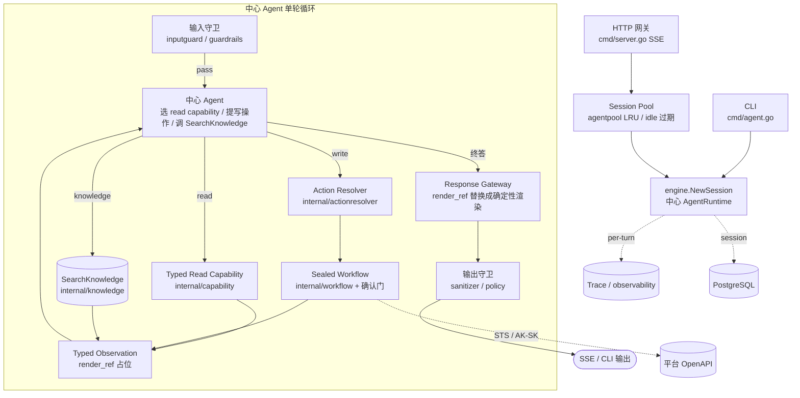

# CompShare Copilot 架构设计

> 优云算力共享平台 AI 助手。本文描述**当前**系统架构、各组件职责与关键设计取舍。
>
> 历史说明:早期版本按 `fast / knowledge / agent` 三个 tier 分流,并用一个 Planner 语义路由 + 渐进式加载的 `internal/skills` playbook。该三层路由栈(`internal/routing`、`cmd/routegen`、route manifests、`internal/skills`、`cmd/skillgen`)已在 **P6 物理删除**。当前是单一中心 Agent 循环 + typed capability。描述旧三层设计的 ADR、plan 与实验报告已在 2026-07-27 清理(它们记录的是被删掉的架构,且大多是更弱模型时代的实验);要追溯设计过程请查 git 历史。

## 1. 概述

CompShare Copilot 是面向优云算力共享(GPU 云)平台用户的 AI 助手,帮用户查实例 / 价格 / 库存 / 规格、回答平台知识问题、以及完成部署和排障这类多步任务。系统是一个 Go 单二进制,支持三种接入:命令行(CLI,`cmd/agent.go`)、HTTP SSE 流式(`cmd/server.go`,`POST /`)、和 WebSocket(`internal/httpapi/ws`,含持久化到 PostgreSQL 的 durable 变体)。三条接入都通过 `engine.NewSession` 创建**同一个中心 AgentRuntime**;`cmd/trace.go` 只负责检索、渲染和 trace 等运行依赖的接线,不再有独立的 Router。

用户请求的复杂度差异极大,但都由同一个中心 Agent 处理——它按需选择只读能力、检索知识、或提出写操作:

| 请求示例 | Agent 怎么处理 |
|---|---|
| "我有哪些实例" / "4090 多少钱" / "现在有货吗" | 选一个 typed **read capability**,拿确定性证据 |
| "怎么用 SecurityToken 签名" / "Qwen 和 DeepSeek 有什么区别" | 在循环内调 `SearchKnowledge` 工具检索、带引用合成 |
| "帮我部署 Qwen32B" / "帮我关掉 train-a" | 经 **Action Resolver** 定目标,提出 **Sealed Workflow** 写操作,过确认门 |

## 2. 核心理念

- **单一中心 Agent。** 不再按 tier 分三套执行管线。一个 ReAct 风格的循环(`internal/engine/`)接收编译好的 `AgentContext`,每轮要么选一个只读 capability、要么调知识检索工具、要么提出一个写操作,并在同一循环里观察工具结果。
- **能力是 typed capability,不是 route manifest。** 模型可见的只读能力在 `internal/capability/read_*.go`,每个能力自带 typed 请求结构、字段合同(`field_contract.go` 的 `schemaNode` 是工具 schema、运行时校验、一致性测试的**单一来源**)、handler 和 renderer。没有独立的路由注册表。
- **read-only 默认,写操作密封。** 变更类操作(创建 / 开关机 / 重启 / 重置密码 / 改名)默认关闭(`COMPSHARE_ENABLE_MUTATING_TOOLS=1` 才开);写操作先经 Action Resolver 确定性定目标,再进 Sealed Workflow,过 resolver / 确认 / 权限 / action-journal 四道门。删除、注销等 L2 破坏性动作无论如何都拒(`internal/tools/safe_executor.go`)。
- **证据驱动 + fail-open。** 回答基于工具返回的事实或检索到的文档;RAG 不是独立管线,而是中心 Agent 在循环内调用的 `SearchKnowledge` 工具。多轮检索先形成独立的完整问题,再生成最多三条检索词。引用纪律是 **fail-open** 的:能引就引,引不出则保留原答案并去掉引用标记,引用格式不能触发整段答案重写;唯一硬停是**原样泄漏检索原文**(安全)。精确平台事实不走这条路,由只读工具服务端渲染。
- **确定性渲染。** 精确的标识、数量、价格、库存、规格、状态由代码渲染成 typed observation,Agent 在最终回答里插入 `render_ref` 占位,由 Response Gateway 替换成确定性结果,防止模型改写数字或截断列表。
- **分层安全。** 输入守卫、工具执行管控、输出脱敏三层独立实施。

## 3. 整体架构

一次请求的主链路是一条固定的确定性流水线,中心 Agent 是唯一的推理点,两侧是确定性的取证 / 定目标 / 渲染:

```
接入(CLI / HTTP)
  → 输入守卫(inputguard / guardrails)
  → 中心 Agent 循环(engine):每轮选一项
       ├─ Typed Read Capability  ── 只读取证,返回 Typed Observation
       ├─ SearchKnowledge 工具    ── 循环内 RAG 取证
       └─ 提出写操作 → Action Resolver(定目标/spec)→ Sealed Workflow(确认门)
  → Response Gateway(把 render_ref 换成确定性渲染)
  → 输出守卫(sanitizer / policy 引用泄漏)
  → SSE / CLI 输出
```



主链路是确定性的:模型只在 Agent 循环里做判断(选能力、写自然语言),控制流、取证、定目标、渲染都在代码里,不让模型直接决定副作用。

## 4. 一次请求怎么走

一轮请求走同一外层骨架,这是一条 short-circuit 链,前一层命中就直接返回:

1. **输入守卫** — 命中拦截规则(越狱 / off-topic / 特定关键词)→ 直接返回固定话术,不进 LLM。
2. **上下文装配** — 恢复未决的实例选择、注入近端事实缓存与压缩历史,编译成 `AgentContext`。
3. **中心 Agent 循环**(`maxReActRounds=16`,`maxHistoryMessages=120`,每轮读类工具预算 `maxReadExpensiveCallsPerTurn=30`;检索另有两层预算:`maxSearchKnowledgeCallsPerTurn=4` 管"决定检索几次",`maxRetrievalQueriesPerTurn=8` 管"实际发出几条 query"——一次决策会扇出多条),每轮:
   - 选一个 **read capability** → `executeConcreteReadCapability` → `capability.MigratedRead(action)` → `RegisteredRead.Run` → 返回 Typed Observation(见 §5、§7)。
   - 调 **`SearchKnowledge`** → 在循环内检索平台知识 / 排障资料作为证据(见 §8)。
   - 提出**写操作** → Action Resolver 确定性定目标 → Sealed Workflow 暂停等确认(见 §6)。
4. **Response Gateway** — 把 Agent 最终回答里的 `render_ref` 占位换成对应 Typed Observation 的确定性渲染;历史监控无数据时整答覆盖为"无法确认"(never-0%/healthy 不变量)。
5. **输出守卫** — 凭证脱敏(IP / UUID / AK-SK / token)+ PII 过滤 + 引用泄漏检查。

## 5. Read capabilities — typed 只读能力

模型可见的只读能力都在 `internal/capability/read_*.go`。每个能力是一条**垂直**:

- **typed 请求结构** + **字段合同**:`field_contract.go` 的 `schemaNode` 是**单一来源**,同时产出模型看到的工具 schema、运行时 enum/最小值校验、和一致性测试。加字段只改一处,三处不漂移。
- **handler**:调平台 OpenAPI,做确定性过滤 / 归一。
- **renderer**:把结果渲染成强约束的 envelope(结构化事实集),逐字段渲染,不经 LLM。
- `ReadDefinitions()`(`read_catalog.go`)是能力目录;引擎经 `executeConcreteReadCapability` 分发,**没有独立路由注册表**。

覆盖:实例列表 / 当前 & 历史监控 / GPU 规格 / 库存 / 价格 / 各类镜像列表 / 计费查询等。让 LLM 参与渲染只会引入不确定性,而这些答案本就是确定的——所以渲染走代码,不走模型。

## 6. 写操作 — Action Resolver + Sealed Workflow

写操作是产品里风险最高的部分,拆成"定目标"和"执行"两段,都不让模型直接决定:

- **Action Resolver(`internal/actionresolver/`)** — 确定性解析写操作的目标实例与 spec(如镜像 catalog 是否需要重查由 `SpecNeedsImageCatalog` 决定)。写目标只在用户回复能确定性解析到某实例时才授权,不用模型"理解候选表"代替确定性选目标。
- **Sealed Workflow(`internal/workflow/`)** — 多步变更流程(创建 / 开关机 / 重启 / 重置密码 / 改名 / 挂盘)以 `*Workflow` 类型存在,步骤序列硬编码,不允许模型自由发 mutating tool。确认经 `engine.ConfirmFunc` 回调(CLI 实现见 `cmd/agent.go::cliConfirm`),Web 端支持暂停 / 恢复。
- **四道门**:mutating 默认关(`COMPSHARE_ENABLE_MUTATING_TOOLS=1` 才开,生产 `config.yaml` 里 `agent.features.mutating_tools: true`),写操作须过 resolver / confirmation / permission / action-journal;删除、注销等 L2 破坏性动作无论如何都拒。密封执行合同(`SealedActionContract`)把确认过的动作与运行元数据分离,镜像等易变字段在执行前重确认。

## 7. Typed Observation + Response Gateway

工具结果不是自由文本,而是 typed observation:

- read capability 返回 `ReadCapabilityObservation`,`Status=Handled` 且有 envelope 时带一个 `render_ref` 占位(`{{READ_OBSERVATION_N}}`)+ 一段 `RenderContract` 指令,告诉 Agent"要展示精确标识 / 数量 / 价格 / 库存 / 规格 / 状态时,在最终回答里原样插入 render_ref,服务端会替换为确定性结果"。
- **Response Gateway**(`engine` 的 `finalizeResponse` / `substituteReadObservationBlocks`)在终答里把 Agent 放置的 `render_ref` 替换成对应 observation 的确定性渲染。Agent 可以自然解释,但精确字段由代码渲染。
- **never-0% 不变量**:历史监控若各实例全无数据,整答覆盖为"无法确认",绝不把缺数据说成 0% / 健康(`guardMonitorNoDataFinalReply`)。

> 说明:`render_ref` 由 Agent 自行插入,`RenderContract` 是给模型的指令、不是机器保证。"精确值一定进最终回答"目前尚未机器强制,是 P7 的硬验收项(若 Agent 漏插 / 写错窗口则验收失败,再收紧出口合同)。

## 8. Knowledge / RAG — 循环内证据,不是独立管线

RAG 是中心 Agent 在循环内调用的**只读工具** `SearchKnowledge`,不是一条会终结请求的独立管线。

**检索管线**(`internal/knowledge/`,默认 `qwen3_rrf`):

```
用户问题 + 必要的对话历史
  → 结构化问题整理(answer_question + 1~3 条 search_queries;首轮无历史时跳过)
  → BM25 关键词 top-50  ⊕  qwen3-embedding-8b 向量 top-50   (hybrid 召回)
  → Reciprocal Rank Fusion 融合 (k=60)
  → qwen3-reranker-8b cross-encoder 精排 top-3
  → 命中片段作为证据,交给带引用的合成
```

- 关键词召回和向量召回各有盲区,hybrid + RRF + cross-encoder 精排比单一召回稳;embedder 和 reranker 用同族(qwen3)比跨族混搭可靠。
- **引用纪律(fail-open)**:合成带引用的中文回答;引不出引用时保留原答案并去掉引用标记,不再为了引用格式重写正文,也不做罐头拒答——唯一硬停是原样泄漏检索原文(安全)。引用标记是否泄漏到最终文本由输出守卫兜底。
- **知识库**:`deploy/kb/stage2b_w0.jsonl` + 两份预计算 embedding sidecar,三件套用 LF 归一 SHA256 字节锁定(`internal/knowledge/corpus_digest.go`),对不上直接拒绝启动。外部工具 / 运维语料(`external_w0.jsonl`)默认合入索引。
- 系统提示由 `internal/prompt/segments.go` 的 Go 段组装,**没有** Go/Python 共用的 prompt 目录(旧的 terminal-RAG `rag_system_segments` 已删)。

## 9. Diagnosis — 只读诊断

`internal/diagnosis/` 是只读诊断链,**模型可见的只有一条**:`DiagnoseBilling`(hand-written registry,非 codegen)。init-failure / GPU-not-detected / image-issue / port-firewall 链在 pre-P7 收敛中删除(无诊断价值,或改由中心 Agent 经 `SearchKnowledge` + `DescribeCompShareInstance` 取证)。`chainRegistry` 恒等于广告集,未广告的诊断名无法 resolve(`TestDiagnosisRegistryHasNoUnadvertisedChains` 强制:model 看不见 ≠ 不可达)。

SSH 是个需要知道的例外:`SSHFailureChain` 的代码仍在、仍会跑,但**不再是 `DiagnoseSSH` 工具**——由 `internal/capability/read_instance_access.go` 直接构造该链,所以 SSH 对模型呈现为 `ReadCapability_instance_access`。它只做云侧预检:精确核对目标实例、生命周期状态、结构化登录入口和监控风险信号,不探测公网端口,也不进入实例检查 SSH 服务或认证日志。

边界规则:只读自检命令可作为用户动作建议,改环境的命令须标"可选修复",绝不自动执行。

## 10. 横切关注点

- **可观测性**(`internal/observability/`)— 每轮写一条 JSONL trace;要确认某条路径是否真触发,读 trace 字段,别靠延迟猜。
- **守卫** — 输入侧在调 LLM 前拦截(`internal/inputguard`、`internal/guardrails`:越狱、off-topic、特定错误码、历史监控等,关键词集不相交);输出侧凭证脱敏 + PII 过滤 + 引用泄漏检查(`internal/sanitizer`、`internal/policy`)。中文场景安全正则须覆盖全角分隔符和中文关键词。
- **限流**(`internal/governance/`)— 按租户(`top_organization_id` / `organization_id` 对)做 QPS + 每日额度,分 LLM / 写操作 / 重读操作三类。
- **安全边界归属** — 密钥 / 权限边界放 `internal/security`;产品级能力拦截(某类请求不支持)放 `internal/policy` 或 engine,两者不混。脱敏逻辑集中,不在各 tool 里内联。
- **截图理解**(`internal/ocr/`,server / WS-only)— `SendCSAgentChat` 带 `Image` 时,Qwen3-VL 把截图解读成结构化文本作为**不可信参考上下文**注入(经 `WrapScreenshotContext` 围栏 + `RedactPII`),原图不进主模型,绝不自动驱动写操作。

## 11. 状态与服务

- **接入** — CLI 单进程单 Engine;HTTP `POST /`(Action 路由)+ `GET /healthz`;WebSocket(`internal/httpapi/ws.go` / `ws_durable.go`,`CreateCSAgentWS`,durable 变体持久化到 PostgreSQL)。身份从请求 body 取(`top_organization_id` / `organization_id` / `request_uuid`,snake_case,网关注入),不走 header。Phase-1 Actions:`GetSession` / `CreateSession` / `Chat`(SSE)/ `GetMeta` / `Feedback`。
- **会话** — HTTP 路径用 `internal/agentpool` 的 LRU 池(200 / 30min idle)维护 per-session Engine,miss 时从 PostgreSQL 经 `RehydrateHistory` 重建历史;同一会话并发请求串行化。
- **持久化** — PostgreSQL(`database/sql` + `lib/pq`;从 MySQL/TiDB 迁移,`store.OpenMySQL` 符号、`mysql` 配置键、`MYSQL_DSN` 环境变量名为兼容保留但连的是 postgres)。`messages` 每轮 INSERT 两次(用户即时、assistant 占位)、SSE done 时 UPDATE 一次,不逐 token 写。DDL 由 ops 跑,不是二进制。
- **配置** — YAML(`deploy/conf/config.local.yaml` 加 `config.prod.yaml` 覆盖),typed 字段在 `agent.features` / `agent.retrieval` / `agent.trace`(见 `internal/config/runtime.go`);不再走 `.env` / `*.example`。
- **凭证** — 生产用 STS AssumeRole 换临时 token,本地开发用静态 AK / SK 直接签名。`SecurityToken` 须先进签名参数再算 HMAC-SHA1。

## 12. 未来方向

- **P7 真实端到端验收** — 真实 HTTP / WebSocket / 前端 / 双标签页 / 逐出 / 重启 / DB 故障;含历史监控终答必含实际时间窗的硬验收(见 §7)。
- **写操作端到端** — workflow 框架已具备,逐个把生命周期操作在 Web 端跑通(SSE 确认链路)。
- **诊断能力** — 未来的 in-instance SSH-ops 能力须在 typed-capability 架构里重建,不复活旧诊断链。
- **MCP** — 若对外暴露 tools / resources,按 server / client 方向拆薄 adapter,只读优先、破坏性动作默认不暴露。

## 附录:`internal/` 包职责

| 包 | 职责 |
|---|---|
| `engine/` | 中心 Agent 循环 + 分发 + Response Gateway |
| `agentruntime/` | 中心 AgentRuntime(CLI / HTTP / 冷建 / rehydrate 共用) |
| `capability/` | typed read/action capability 目录 + 字段合同(单一来源 schema) |
| `actionresolver/` | 写操作确定性定目标 / spec 解析 |
| `workflow/` | Sealed 写操作 workflow 定义 + 确认 |
| `intent/` | 共享 intent / 生命周期动作类型 + 结构化信号 |
| `knowledge/` | hybrid 检索 + RRF + rerank(`SearchKnowledge` 工具后端) |
| `prompt/` | 系统提示段(`segments.go`)组装 |
| `readprojection/` | 只读结果投影 / 截断 / GPU 家族匹配 / 渲染 |
| `envelope/` | 结构化事实 envelope |
| `diagnosis/` | 只读诊断链(SSH / billing)+ registry |
| `tools/` | tool spec + 安全执行器(read/mutating 策略、L2 拒绝) |
| `llm/` | 模型客户端 + capability(如 `supportsObjectToolChoice`) |
| `inputguard/`、`guardrails/` | 输入侧拦截 |
| `sanitizer/`、`security/`、`policy/` | 输出脱敏 / 密钥边界 / 引用泄漏 & 产品拦截 |
| `governance/` | 限流(按租户、按类别) |
| `observability/`、`turntrace/`、`turncoord/` | trace / 每轮记录 / 轮次协调 |
| `ocr/` | 截图理解(server / WS-only,Qwen3-VL) |
| `httpapi/`(含 `ws/`) | HTTP / WebSocket 接入 |
| `agentpool/` | per-session Engine 池 |
| `store/` | PostgreSQL 持久化 |
| `platform/`、`entity/`、`zones/` | 平台类型 / 实例解析 / 可用区 |
| `embedding/`、`reranker/` | 检索侧 embedder / cross-encoder |
| `config/` | YAML 配置 + runtime flag |
| `refusal/`、`deployment/`、`textutil/`、`architectureguard/` | 拒答话术 / 部署匹配 / 文本工具 / 架构守卫 |
