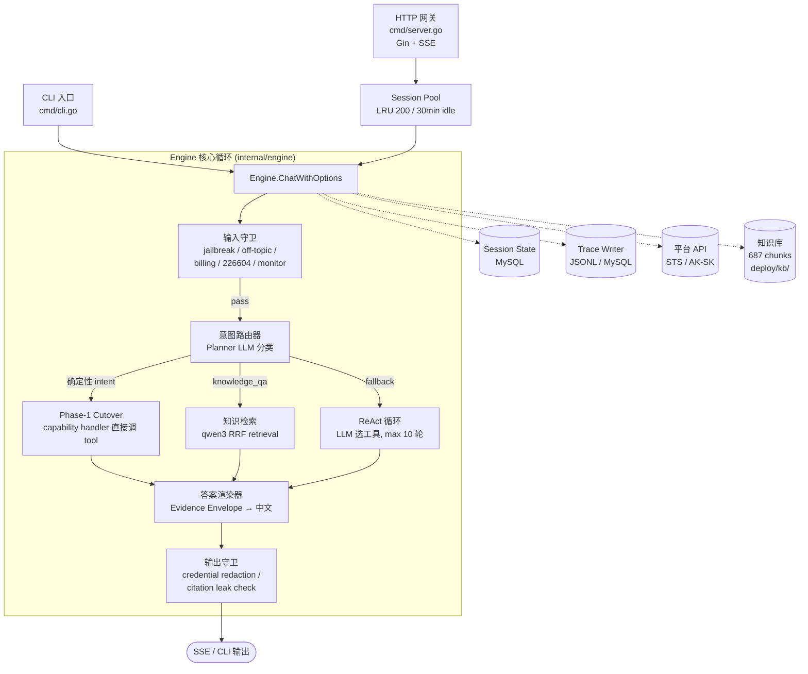

# CompShare Agent 设计文档

## 1. 概述

CompShare Agent 是优云算力共享平台的 AI 助手，面向平台用户提供 GPU 实例管理、价格/库存/规格查询、故障诊断、平台知识问答等服务。系统以 Go 单二进制交付，支持 CLI 交互和 HTTP SSE 两种接入方式。

### 设计原则

- **确定性优先**：能用确定性逻辑处理的请求不走 LLM 推理。当前 55-65% 的请求通过确定性分发处理。
- **只读默认**：变更类操作（创建/开关机/重启等）默认关闭，通过环境变量显式开启。
- **证据驱动**：回答基于工具返回的事实或知识库检索的文档，没有证据时明确说明而非凭记忆编造。
- **分层安全**：输入过滤、工具执行管控、输出脱敏三层独立实施。

---

## 2. 整体架构



### 接入层

| 接入方式 | 入口 | 特点 |
|---|---|---|
| CLI | `cmd/cli.go` | 单进程单 Engine，`bufio.Scanner` 读取输入，`cliConfirm` 做确认 |
| HTTP | `cmd/server.go` | Gin 路由，5 个 Action（CreateSession / GetSession / Chat / GetMeta / Feedback），Chat 走 SSE |

HTTP 路径通过 `agentpool` 维护 per-session Engine（LRU 200 / 30min idle），cache miss 时从 MySQL 重建对话历史（`engine.RehydrateHistory`）。同一 session 的并发 Chat 通过 `Lease()` 的 entry mutex 串行化。

### 身份与凭证

请求身份从 HTTP body 提取（`top_organization_id` / `organization_id`），不走 header。API 调用凭证两条路径：
- **STS AssumeRole**（生产）：`service_ak/service_sk` → AssumeRole → 临时 SecurityToken
- **静态 AK/SK**（本地开发）：`public_key/private_key` 直接签名

---

## 3. 意图路由

### 路由器：Planner

`internal/intent/planner.go` 实现了一个轻量 LLM 分类器，输入用户消息 + 最近几轮对话摘要，输出结构化 `IntentPlan`（intent label + slots + confidence）。

当前定义的 intent：

| Intent | 说明 | 分发路径 |
|---|---|---|
| `gpu_specs_query` | GPU 规格参数查询 | Capability cutover |
| `stock_availability` | 库存/售罄查询 | Capability cutover |
| `pricing_query` | 价格查询 | Capability cutover |
| `platform_image_list` | 平台镜像列表 | Capability cutover |
| `custom_image_list` | 自定义镜像列表 | Capability cutover |
| `community_image_list` | 社区镜像列表 | Capability cutover |
| `resource_info` | 用户实例信息 | Capability cutover |
| `monitor_query` | 当前监控数据 | Capability cutover |
| `knowledge_qa` | 平台知识问答 | RAG retrieval |
| `diagnosis` | 故障诊断 | Clarification → ReAct |
| `vague_failure` | 模糊故障描述 | Clarification 追问 |
| `monitor_history` | 历史监控（不支持） | Hard-block 拒答 |
| `billing_account_unsupported` | 账户级计费（不支持） | Hard-block 拒答 |
| `operation_lifecycle` | 变更操作 | ReAct (写操作关闭时引导) |
| `recommendation` | GPU 选型推荐 | ReAct |
| `unknown` | 无法识别 | ReAct fallback |

### 分发优先级链

`ChatWithOptions` (`engine.go:749`) 的分发是严格顺序的 short-circuit 链：

```
1. 输入守卫 (preblock)        → 命中则返回 canned reply
2. 资源选择恢复               → 有 pending selection 则恢复
3. Planner 分类               → 命中确定性 intent 则走 cutover / RAG
4. ReAct 循环                 → 兜底
```

每一层都是 `if reply, handled := tryXxx(); handled { return }` 的 early-return 模式，后续层只在前序层均未命中时触发。

---

## 4. Skill 体系

系统将处理能力组织为若干 Skill，每个 Skill 覆盖一组相关 intent，拥有独立的工具集和行为规则。

### 4.1 CatalogSkill — 目录查询

覆盖 GPU 规格、库存、价格、镜像列表查询。

**执行模式：确定性分发。** handler 根据 planner 提取的 slots 直接调用对应 API tool，不经过 LLM tool selection。

**注册表 (`capability_registry.go:31`)：**

| Intent | 主工具 | 辅助工具 |
|---|---|---|
| `gpu_specs_query` | `DescribeAvailableCompShareInstanceTypes` | — |
| `stock_availability` | `DescribeAvailableCompShareInstanceTypes` | `DescribeCompShareImages`, `CheckCompShareResourceCapacity` |
| `pricing_query` | `GetCompShareInstancePrice` | — |
| `platform_image_list` | `DescribeCompShareImages` | — |
| `custom_image_list` | `DescribeCompShareCustomImages` | — |
| `community_image_list` | `DescribeCommunityImages` | — |

handler 在 `capability_registry.go` 中实现，每个 handler 的典型流程：
1. 从 planner slots 提取过滤条件（GPU 型号、可用区等）
2. 调用 API tool
3. 对 API 结果做确定性过滤和格式化
4. 构造 `envelope.Envelope`（结构化事实集合）
5. 交给 Grounded Renderer 渲染为自然语言

**数据驱动注册：** 每个 capability 在 `internal/intent/capabilities/` 下有一个 `.md` 文件，frontmatter 包含 planner 分类指令和示例。添加新 capability 是纯数据操作——写 `.md` 文件 + 在 registry 表里加一行。

### 4.2 ResourceSkill — 实例与监控

覆盖 `resource_info`（实例列表/详情）和 `monitor_query`（当前监控数据）。

**执行模式：确定性分发 + entity 解析。** handler 需要解析用户指定的实例目标（ID、名称、序号），通过 `entity.EntityRegistry` 做实例匹配。多实例歧义时触发资源选择交互（`pendingResourceSelection`）。

**特殊机制：**
- Monitor recall：相邻轮次的监控追问强制重新调用 API 而非复用历史数据
- Monitor temporal guard：检测历史时间窗口请求并拒答（当前只支持实时监控）

### 4.3 KnowledgeSkill — 平台知识问答

覆盖 `knowledge_qa`（计费规则、操作教程、FAQ 等）。

**执行模式：RAG 检索 + Grounded Rendering。** 不使用任何 tool，走独立的检索链路。

**检索管线 (`internal/knowledge/`)：**

```
用户问题
  → BM25 top-50 ⊕ qwen3-embedding-8b dense top-50
  → Reciprocal Rank Fusion (k=60)
  → qwen3-reranker-8b cross-encoder top-3
  → 检索结果作为 evidence 传入 Grounded Renderer
```

检索模式通过 `RAG_RETRIEVAL_MODE` 环境变量切换（`qwen3_rrf` 默认）。知识库为 `deploy/kb/stage2b_w0.jsonl`（687 chunks），通过 SHA256 digest 字节锁定。

**Grounded Renderer (`internal/renderer/`)：** 接收 `envelope.Envelope`（结构化事实），调用 LLM 生成带引用的中文回答。回答必须基于 envelope 中的证据，无证据时要求模型拒答。

### 4.4 DiagnosisSkill — 故障诊断（后期优化）

覆盖 `diagnosis`（明确故障）和 `vague_failure`（模糊描述）。

**执行模式：当前走 ReAct fallback。** planner 能分类 diagnosis intent 并提取症状类型 + 目标实例 slots，但 handler 目前只做 clarification（追问实例/症状），实际诊断工具调用由 ReAct loop 处理。当前重心是资源查询和用户问答能力完善，Diagnosis Skill 的独立注册和 scoped ReAct 改造安排在后期。

**诊断工具集 (`internal/diagnosis/`)：**

| 工具 | 场景 |
|---|---|
| `DiagnoseSSH` | SSH 连接失败 |
| `DiagnoseInitFailure` | 实例初始化失败 |
| `DiagnoseGPU` | GPU 不识别 / nvidia-smi 报错 |
| `DiagnoseBilling` | 计费异常 |
| `DiagnosePortOrFirewall` | 端口不通 / 防火墙 |
| `DiagnoseImageIssue` | 镜像问题 |

每个诊断工具内部执行：查实例状态 → 比对已知故障模式 → 输出诊断结论 + 建议操作。所有诊断是**只读的云侧检查**，不会 SSH 进入实例或修改实例环境。

**边界规则：** 建议用户自行执行的只读命令（`nvidia-smi`、`ss -lntp`）可以直接给出；涉及环境修改的命令（`systemctl restart`、安装软件）必须标记为"可选修复"。

### 4.5 OperationSkill — 变更操作（默认关闭）

覆盖实例生命周期管理。通过 `COMPSHARE_ENABLE_MUTATING_TOOLS=1` 开启。

**执行模式：Pipeline workflow。** 每个操作定义为 `workflow.Definition`，由顺序 `Step` 组成，步骤类型为 `StepToolCall`（调 API）或 `StepConfirm`（等用户确认）。

**已定义的 workflow：**

| Workflow | 步骤 |
|---|---|
| `CreateInstanceWorkflow` | 查镜像 → 查配比 → 检查库存 → 查价格 → **确认** → 创建 → 查看状态 |
| `StopInstanceWorkflow` | 查实例 → **确认**（提醒磁盘费用） → 关机 |
| `StartInstanceWorkflow` | 查实例 → 开机 |
| `RebootInstanceWorkflow` | 查实例 → **确认** → 重启 |
| `ResetPasswordWorkflow` | 查实例 → **确认** → 重置密码 |
| `RenameInstanceWorkflow` | 查实例 → 改名 |
| `SetStopSchedulerWorkflow` | 查实例 → **确认** → 设定时关机 |
| `CancelStopSchedulerWorkflow` | 查实例 → 取消定时关机 |

workflow engine (`workflow/engine.go`) 逐步执行，通过 `StepEvent` 回调向调用方报告进度，通过 `ConfirmFunc` 回调请求用户确认。

### 4.6 FallbackAgent — ReAct 兜底

覆盖所有未被上述 Skill 处理的请求。

**执行模式：LLM 自主 tool calling。** LLM 看到全部可用工具的 schema（read-only 模式 19 个），自主决定调用哪个工具，最多 10 轮。

这是系统的安全网——即使 planner 分类错误或遗漏，用户问题仍然能通过 ReAct 得到处理。代价是延迟更高、token 消耗更大、工具选择可能不精确。

---

## 5. 状态管理

### 5.1 对话历史

per-session 的 `messages []openai.ChatCompletionMessage`，最多保留 40 条非 system 消息（`maxHistoryMessages=40`），超限时从最旧端裁剪，对齐到安全消息边界避免 orphaned tool_call。

HTTP 路径通过 MySQL `messages` 表持久化，`agentpool` cache miss 时调用 `engine.RehydrateHistory` 重建。

### 5.2 Session State

`SessionState` (`engine/session_state.go`) 是 per-session 的结构化状态快照，通过 MySQL `sessions.context` 列持久化，`context_version` 做 CAS 乐观锁。

当前字段：

| 字段 | 写入时机 | 用途 |
|---|---|---|
| `SelectedInstanceID` | 实例查询/选择成功时 | 记住用户最近操作的实例 |
| `SelectedInstanceName` | 同上 | 配合 ID 用于显示 |
| `LastIntent` | 每次 planner 分类后 | 记住上一轮意图，辅助多轮连续性 |
| `RecentFacts` | tool call 成功后 | 累积工具返回的关键事实 |

`RecentFacts` 的每条 `ToolFact` 以 `(Kind, SubjectID)` 为去重键，`ProducedAtTurn` 记录产出轮次，跨副本合并时取较新值。

---

## 6. 安全边界

### 6.1 输入守卫 (`internal/engine/preblock.go`)

基于 `internal/router.Rule` 链的关键词匹配，在 LLM 调用之前拦截：

| 规则 | 包 | 触发 |
|---|---|---|
| Jailbreak 检测 | `guardrails.DetectJailbreakAttempt` | 指令覆盖模式 |
| Off-topic 检测 | `guardrails.DetectOffTopic` | 政治/医疗/投资/情绪危机 |
| 账户计费拦截 | `engine.isAccountBillingUnsupported` | 余额/账单/财务 |
| 资源不足拦截 | `engine.isResourceShortageQuestion` | 错误码 226604 |
| 历史监控拦截 | `engine.isUnsupportedHistoricalMonitorQuestion` | 指定历史时间段监控 |

规则之间关键词集合不相交，顺序不影响正确性。

### 6.2 工具执行管控 (`internal/tools/safe_executor.go`)

- **Mutating guard**：写操作工具默认不注册到 LLM 可见列表
- **Rate limiting** (`internal/governance/`)：per-tenant 的 QPS + 每日额度，分 LLM / mutating / read-expensive 三个类别
- **参数过滤**：`filterSafeArgs` 只允许工具 schema 中声明的参数通过，未声明参数被丢弃
- **Token budget**：`maxTokensPerTurn` 限制单轮 LLM 总 token（含 planner + ReAct 所有调用）

### 6.3 输出守卫

- **Credential redaction** (`guardrails/output.go`)：从 assistant 回复中正则匹配并替换 IPv4、Project UUID、AK/SK、Bearer/JWT token
- **PII redaction** (`guardrails/pii.go`)：输入侧的个人信息过滤
- **Citation leakage** (`policy/leakage.go`)：检测 RAG 回答中的引用标记是否泄露到最终输出
- **Secret boundary** (`security/secret_boundary.go`)：集中管理敏感字段脱敏

---

## 7. 可观测性

`internal/observability/` 提供 per-turn JSONL trace，记录：

| 字段 | 内容 |
|---|---|
| `planner` | intent / slots / confidence / latency |
| `retrieval` | mode / query / hit_count / top scores |
| `renderer` | model / latency / fallback / envelope_hash |
| `outcome` | hard_block / rate_limit / tool_calls |
| `token_usage` | prompt / completion / total per LLM call |

trace 支持写入文件（`COMPSHARE_TRACE_DIR`）和/或 MySQL（`deploy/migrations/0002_create_agent_traces.sql`），通过 `COMPSHARE_TRACE_ENABLED=1` 开启。保留期由 `DefaultTraceRetentionDays` 控制。

---

## 8. 知识库

### 语料管理

`deploy/kb/` 存放客户侧 FAQ 语料和预计算的 embedding sidecar：

| 文件 | 说明 |
|---|---|
| `stage2b_w0.jsonl` | 语料主文件，687 chunks |
| `embeddings_<hash>.jsonl` | text-embedding-3-large (3072d) sidecar |
| `embeddings_<hash>_qwen3-embedding-8b.jsonl` | qwen3-embedding-8b (4096d) sidecar |

三个文件通过 LF-normalized SHA256 字节锁定在 `internal/knowledge/corpus_digest.go`。**语料变更时必须同时重新生成两个 sidecar 并更新三个 digest 常量。**

### 语料构建

`scripts/rag_w0/` 下的 Python pipeline 负责从源文档构建语料（17 stage pipeline），产出 JSONL chunk。构建过程不影响 Go 二进制，仅在知识库需要更新时运行。

---

## 9. 部署架构

```
                    ┌──────────────────┐
                    │   控制台前端      │
                    └────────┬─────────┘
                             │ POST / (SSE)
                    ┌────────▼─────────┐
                    │   API 网关        │
                    │   (身份注入)       │
                    └────────┬─────────┘
                             │
                    ┌────────▼─────────┐
                    │  compshare-agent  │
                    │  server --addr    │
                    │  :8080            │
                    ├───────────────────┤
                    │  agentpool (LRU)  │
                    │  per-session      │
                    │  Engine           │
                    └──┬─────┬─────┬───┘
                       │     │     │
              ┌────────┘     │     └────────┐
              ▼              ▼              ▼
        ┌──────────┐  ┌──────────┐  ┌──────────┐
        │ MySQL 8  │  │ LLM API  │  │ 平台 API │
        │ sessions │  │ (ds-v4-  │  │ (STS /   │
        │ messages │  │  flash)  │  │  AK-SK)  │
        │ traces   │  └──────────┘  └──────────┘
        └──────────┘
```

### 配置

`deploy/conf/agent.yaml` 支持 `${ENV_VAR}` 占位符。关键配置项：

- `agent.llm` — LLM BaseURL / APIKey / Model
- `agent.rate_limit` — QPS / Daily / MaxTokensPerTurn
- `agent.http` — ListenAddr / Timeout / PoolCapacity / SSEKeepaliveInterval
- `agent.mysql` — DSN / 连接池
- `agent.sts` — STS AssumeRole 凭证
- `agent.meta` — Welcome 语 / 推荐问题 / MaxInputLength

### 运行时特性开关

| 环境变量 | 默认 | 作用 |
|---|---|---|
| `COMPSHARE_ENABLE_MUTATING_TOOLS` | off | 开启写操作 |
| `USE_INTENT_PLANNER_FOR` | 8 intents | 控制 planner cutover 范围 |
| `USE_KNOWLEDGE_RETRIEVAL` | `curated` | RAG 开关 |
| `RAG_RETRIEVAL_MODE` | `qwen3_rrf` | 检索管线模式 |
| `USE_GROUNDED_RENDERER` | `llm` | 渲染器开关 |
| `COMPSHARE_TRACE_ENABLED` | off | Trace 开关 |

---

## 10. 后续演进方向

### 近期

- **System prompt 模板化**：当前 `systemTemplate` / `readOnlySystemTemplate` 有 60% 重复。拆分为 base + per-skill segment，按 intent 按需组合。
- **SessionState 消费**：`SelectedInstanceID` 注入到 handler 和 system prompt，支持多轮中 "重启它" 自动关联上一轮查询的实例。
- **OCR 上下文**：HTTP 请求支持图片字段，通过 DeepSeek OCR（ModelVerse API）提取截图文本注入对话上下文，支持客服群场景。

### 中期

- **Diagnosis 确定性分发**：将 diagnosis intent 从 ReAct fallback 迁移到独立 Skill，需先扩展 capabilityEntry 结构支持多工具 chain。
- **Per-skill 工具子集**：已知 intent 走 ReAct 时只暴露相关工具子集，减少 LLM 工具选择噪声。
- **写操作开放**：CLI 路径完成 workflow 端到端测试后切换开关；HTTP 路径需额外实现 SSE 确认机制（`denyConfirm` 当前硬编码拒绝）。
- **控制台上下文**：HTTP 请求携带 `ConsoleContext`（页面路由、当前错误、选中资源 ID），引擎据此增强意图判断和资源定位。

### 远期

- **SSE 交互事件**：暴露 `StepEvent` 为 SSE 帧，前端可渲染操作进度、确认弹窗、资源选择卡片。
- **HTTP Interrupt/Resume**：SSE 流中挂起等待用户确认，通过独立 callback 端点回传用户决策，实现 Web 端的 Human-in-the-Loop。
