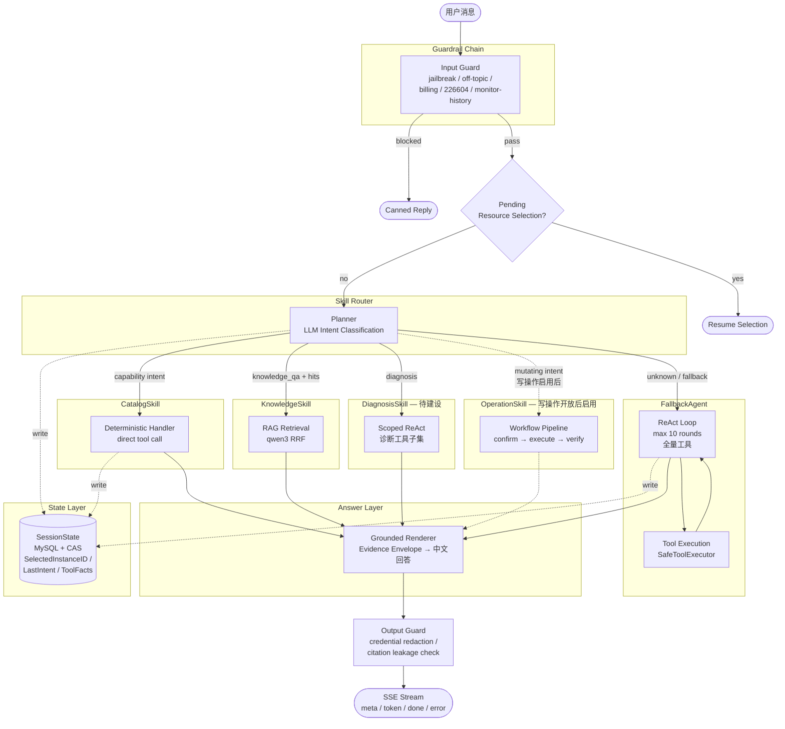

# CompShare Agent 优化方案

> **定位**：优云算力共享平台控制台 AI 助手
> **当前状态**：单 Engine 架构，Planner Router + Capability Cutover + ReAct Fallback 三层分发，read-only 默认，HTTP SSE 服务已上线
> **目标**：对齐业界主流 Agent 架构术语，完成 Skill 化组织，扩大确定性分发覆盖率，为写操作开放和控制台嵌入做好准备

---

## 1. 当前架构概览

### 1.1 执行图



### 1.2 Skill 清单

| Skill | Intent | 执行模式 | 工具集 | 业界对标 |
|---|---|---|---|---|
| **CatalogSkill** | gpu_specs / stock / pricing / platform_image / custom_image / community_image | Deterministic（handler 直接调 tool，不经 LLM 选择） | 6 tools | Anthropic Routing / AWS Action Group |
| **ResourceSkill** | resource_info / monitor_query | Deterministic | 3 tools | Anthropic Routing |
| **KnowledgeSkill** | knowledge_qa | RAG Retrieval + Grounded Render | 0 tools（走 retriever） | Anthropic Chaining / AWS Knowledge Base |
| **DiagnosisSkill** — 后期优化 | diagnosis / vague_failure | 当前走 ReAct fallback，后期改 Scoped ReAct | 9 tools | Anthropic Orchestrator-Workers |
| **OperationSkill** — 写操作后启用 | create / stop / start / reboot / rename / reset_password / set_stop_scheduler | Pipeline（确认 → 执行 → 验证） | 8 workflows | LangGraph Subgraph with interrupt |
| **FallbackAgent** | unknown / 未覆盖 | Full ReAct（全量工具） | 19 tools (read-only) | LangGraph ReAct Agent |

### 1.3 与业界框架对标

| 维度 | LangGraph | OpenAI SDK | Google ADK | AWS Bedrock | **CompShare** |
|---|---|---|---|---|---|
| 编排 | StateGraph 有向图 | Handoff + Agent-as-Tool | Agent 树 + AutoFlow | Supervisor + Action Group | **Planner Router + Cutover + ReAct** |
| 状态 | Checkpoint 时间旅行 | Context Var 瞬态 | Session.state | Episodic Memory | **SessionState + MySQL CAS** |
| Guardrail | 节点级 | Input/Output 并发 | Agent 级 | Guardrails + Cedar Policy | **3 层：preblock / SafeExecutor / output** |
| Evidence | 无 | 无 | 无 | 无 | **✅ Envelope + Grounded Renderer（独有）** |
| RAG 路由 | 需自建 | 需自建 | 需自建 | Knowledge Base（浅集成） | **✅ 一等分发路径（非 tool）** |

---

## 2. 优化方案

### Phase 0：在飞 PR 收尾

| 任务 | PR | LOC | 状态 |
|---|---|---|---|
| Q10 custom-image fix | #174 | +70 | Review → merge |
| Stock cross-region default | #172 (PR-δ0) | +10/-97 | Review → merge |
| 旧 PR-δ salvage → close | #170 | — | Salvage 4-state 文案后关闭 |
| Roadmap doc 更新 | #173 | — | 用本文档替代 |

### Phase 1：Skill 化组织 + 基础改进

**目标：** 用业界术语重新组织现有模块，让架构文档可被同事直接理解。

#### 1.1 System Prompt 按 Skill 拆分

**问题：** `builder.go` 维护 `systemTemplate` 和 `readOnlySystemTemplate` 两份 170 行 prompt，60-65% 重复。
**方案：** 拆为 base prompt + per-skill segment，用模板组合：

```
internal/prompt/
  base.go              → 通用段（你是谁 / 范围边界 / 拒答规则 / 安全规则 / 回复风格）
  segment_catalog.go   → CatalogSkill 行为规则（价格查询 / 库存 / 规格）
  segment_diagnosis.go → DiagnosisSkill 行为规则（诊断工具 / 追问 / 刷新）
  segment_knowledge.go → KnowledgeSkill 行为规则（知识来源边界 / citation）
  segment_operation.go → OperationSkill 行为规则（创建 / 开关机 / 确认协议）
  segment_resource.go  → ResourceSkill 行为规则（实例查询 / 监控刷新）
  builder.go           → 组合 base + 按需 segments
```

**效果：**
- 消除 60% 模板重复
- 写操作开关从 "切换整个 template" 变为 "是否加载 segment_operation"
- 文档可以说 "每个 Skill 有独立的 Prompt Context"

**涉及文件：** `internal/prompt/builder.go` (拆分) + 新建 segment 文件
**估计：** ~200 LOC

#### 1.2 capabilityEntry 扩展 skillGroup

**方案：** 给 `capabilityEntry` 加 `skillGroup` 和 `toolSubset` 字段：

```go
type capabilityEntry struct {
    intent       Intent
    skillGroup   string            // "catalog" / "resource" / "diagnosis" / "knowledge" / "operation"
    requiredTool string
    handler      func(...)
    toolSubset   []string          // ReAct fallback 时只暴露这些工具给 LLM
    promptSegment func() string    // 返回该 skill 的 prompt segment
}
```

当前 6 个 capability 加 `skillGroup = "catalog"`。resource_info / monitor_query 走独立 dispatch 路径（`engine.go` 的 `HandleResourceInfo` / `HandleMonitorQuery`），不进入 `capabilityRegistry`，仅在文档 Skill 表中归为 ResourceSkill。

**效果：**
- 代码结构可 1:1 映射到文档的 Skill 清单
- `toolSubset` 为后续 per-skill ReAct 做准备
- 不改变运行时行为（data-only 扩展）

**涉及文件：** `internal/intent/capability_registry.go`
**估计：** ~50 LOC

#### 1.3 Diagnosis Skill（降优先级 — 后期优化）

**当前状态：** planner 已能分类 `diagnosis` / `vague_failure` intent 并提取症状+目标 slots，handler 做 clarification 追问后回退 ReAct。6 条诊断链（SSH / InitFailure / GPU / Billing / PortFirewall / ImageIssue）实际运行在 ReAct 全量工具环境。

**暂不实施的原因：**

1. **结构不兼容。** `capabilityEntry` 要求 `requiredTool`（单工具），Diagnosis 链内部调 2-3 个工具（如 `PortFirewallChain` 需要 `DescribeCompShareInstance` + `DescribeCompShareSoftwarePort`）。注册为 capability 需要先扩展 entry 结构支持多工具或 chain 调度，不是 data-only 变更。
2. **当前重心是资源查询和用户问答。** Diagnosis 占请求 ~10-15%，优先级低于 CatalogSkill / KnowledgeSkill 的完善。

**后期实施备忘（非本轮 scope）：**

- `toolSubset` 应包含：`DiagnoseSSH`, `DiagnoseInitFailure`, `DiagnoseGPU`, `DiagnoseBilling`, `DiagnosePortOrFirewall`, `DiagnoseImageIssue`, `DescribeCompShareInstance`, `GetCompShareInstanceMonitor`, `DescribeCompShareSoftwarePort`（共 9 个，端口诊断链第二步需要此 API）
- 需要扩展 `capabilityEntry` 或引入平行的 `diagnosisEntry` 结构
- 复杂诊断走 scoped ReAct 方向不变

#### 1.4 多 Region 整改（已完成）

PR-δ0（#172）合并后，6/7 mutating workflow 的 Region 线程化已完成（stop / start / reboot / rename / reset-password / scheduler），均有 `region_test.go` 覆盖。

**唯一缺口：** CreateInstance workflow 的 4 个查询工具 schema 未声明 Region 参数。延期到 Phase 3 与写操作开放一起处理（写操作默认关闭，当前不影响用户）。PR-γ 在代码中无定义，PR-δ 范围已被 PR-δ0 覆盖。

#### 1.5 架构文档产出

产出面向部门同事的架构文档 `docs/architecture.md`，内容包括：
- §1 Mermaid 执行图（上面 1.1 节的图）
- §2 Skill 清单表
- §3 与 LangGraph / OpenAI SDK / Google ADK / AWS Bedrock 对标表
- §4 状态管理（SessionState + MySQL CAS）
- §5 安全边界（3 层 Guardrail）
- §6 Evidence-based Rendering（独有设计说明）

**估计：** ~300 行文档

---

### Phase 2：上下文能力增强

#### 2.1 SessionState 简化读取

**问题：** M2 已写入 `SelectedInstanceID` / `LastIntent` / `RecentFacts`，但无读者。
**方案：**

**2.1a — monitor fallback（已完成）：**

1. `HandlerRequest` 新增 `FallbackInstanceID string` 字段
2. `engine.go` tryPhase1Cutover Site 1 从 `e.sessionState.SelectedInstanceID` 填充
3. `HandleMonitorQuery` 在 TargetRefs 为空时用 FallbackInstanceID 合成 TargetRef，优先级：planner target > SessionState > 退回追问
4. 3 个单元测试覆盖：fallback used / ignored / unresolved

**2.1b — system prompt + planner context（待做）：**

- 将 `SelectedInstanceID` 注入 system prompt 的用户状态段
- 将 `LastIntent` 注入 planner input（辅助多轮连续性判断）
- 需要解决 HTTP 路径 `RehydrateHistory` 无法拿到 SessionState 的时序问题（buildEngine 在 SetSessionState 之前调用）

**不做完整 ContextAssembler**——等第二个消费者出现再泛化。

**涉及文件：** `internal/intent/handler.go` + `internal/engine/engine.go` + `internal/intent/handler_monitor_test.go`

#### 2.2 OCR 图片上下文注入

**问题：** 用户在客服群发 CUDA OOM / nvidia-smi / 端口错误截图，当前无法被 agent 消费。
**方案：**

1. HTTP `SendCSAgentChat` 请求体加可选 `Image` 字段（base64 或 URL）
2. engine 在 pre-planner 位置调 DeepSeek OCR（通过 ModelVerse API Key 调用）提取图中文字
3. 提取结果作为 user message 补充上下文注入（拼接在 `userMsg` 前面，标记 `[图片识别内容]`）
4. Trust contract：OCR 结果标记为 `user_provided_unverified`，低置信度供后续环节参考

**不依赖前端。** 消费路径：客服系统 / HTTP API → base64 image → DeepSeek OCR → context 注入。

**边界约束（产品化必须覆盖）：**
- 图片大小限制：max 10MB（base64 编码后 ~13MB），超限返回 400
- 格式校验：仅接受 PNG / JPEG / WebP
- 分辨率：超过 4096×4096 时先 resize（长边缩至 4096）
- OCR 超时：10s，超时时不阻塞主流程，标记 `[图片识别失败]` 继续
- 失败降级：OCR 返回空或调用失败 → 不注入图片上下文，不影响正常对话
- 脱敏：OCR 结果经过 `guardrails/pii.go` 过滤后再注入
- 落库：OCR 文字结果落 `messages` 表（作为 user message 的一部分），原始图片不落库
- 模型配置：独立的 `agent.ocr.model` + `agent.ocr.api_key` 配置项（复用 ModelVerse API Key）

**涉及文件：** `internal/httpapi/dispatch.go` (请求解析 + 校验) + `internal/engine/engine.go` (OCR 调用) + `internal/config/config.go` (OCR 配置) + `internal/llm/` (OCR client)
**估计：** ~400 LOC

#### 2.3 Per-Skill Tool Subset 实装

**问题：** ReAct fallback 路径给 LLM 全部 19 个工具（read-only），diagnosis 场景存在工具选择噪声。
**方案：**

1. 扩展 `VisibleRegistry` 为 `VisibleRegistryForIntent(intent, mutatingEnabled)`
2. 已知 intent 且 handler fallback 到 ReAct 时（如 diagnosis 的复杂 case），只传 `toolSubset`
3. Unknown intent 继续传全量工具（安全网不动）

**涉及文件：** `internal/tools/registry.go` + `internal/engine/engine.go`
**估计：** ~80 LOC

---

### Phase 3：写操作开放

#### 3.1 Workflow 端到端测试

**问题：** 8 个 Workflow 基础设施就绪，但缺真实 API 端到端 smoke test。
**方案：**

1. 建立 `eval/shadow_qa/workflow-smoke/` 目录
2. 每个 workflow 至少 2 个 case（happy path + 失败回退）
3. 重点测试 `CreateInstanceWorkflow`（最复杂：镜像选择 + 规格匹配 + 库存检查 + 确认）
4. 确保 multi-region workflow 正确（依赖 Phase 1 的 PR-β1）

**估计：** ~500 LOC 测试

#### 3.2 OperationSkill Prompt Segment

**问题：** 写操作开放后需要创建/开关机/重置密码等行为规则。
**方案：** Phase 1.1 已建好 `segment_operation.go`，`COMPSHARE_ENABLE_MUTATING_TOOLS=1` 时自动加载。

**估计：** 已在 Phase 1.1 中完成，0 额外工作。

#### 3.3 写操作开放

写操作开放不是单一开关，需要分接入路径处理：

**CLI 路径：** `COMPSHARE_ENABLE_MUTATING_TOOLS=1` 即可（`cmd/cli.go` 读取 env var → `SessionOptions.MutatingToolsEnabled`）。CLI 路径的 `cliConfirm` 已能通过 stdin 完成用户确认。

**HTTP 路径需要额外工作：**
1. `agentpool/rehydrate.go:39` 当前硬编码 `MutatingToolsEnabled: false` — 需要改为从配置或请求读取
2. `denyConfirm` (`rehydrate.go:15`) 永远 return false — 需要替换为 HTTP 兼容的确认机制（依赖 Phase 4.3 的 SSE interrupt/resume）
3. 前端需要展示确认 UI 组件

**因此 HTTP 路径的写操作实际依赖 Phase 4.3（HTTP Interrupt/Resume），Phase 3.3 只覆盖 CLI 路径。**

---

### Phase 4：控制台适配（依赖前端）

#### 4.1 SSE Step 事件暴露

**问题：** Engine 产出 `StepEvent` 但 `handleChat` 吞进 trace-only，前端无进度反馈。
**方案：**

1. 定义前端安全的投影结构 `SSEStepPayload`，只暴露 `Type` / `Action` / `Message` / `StepIndex` / `Total`
2. **不暴露的字段：** `Display`（注释写着 "CLI display only"）、`TraceResult`（trace hashing 专用）、`Args`（含内部 API 参数）、`Capped` / `CapReason`（限流内部信息）
3. `handleChat` 的 `onStep` 回调增加 `sse.WriteEvent("step", projectedPayload)`

**涉及文件：** `internal/httpapi/handlers_chat.go` + `internal/httpapi/types.go` (新增 SSEStepPayload)
**估计：** ~80 LOC

#### 4.2 ConsoleContext 注入

**方案：** `BaseRequest` 加 `ConsoleContext` 字段（page_route / error_code / selected_resource_ids），注入 planner input 和 system prompt。

**涉及文件：** `internal/httpapi/dispatch.go` + `internal/engine/engine.go` + `internal/prompt/builder.go`
**估计：** ~200 LOC

#### 4.3 HTTP Interrupt/Resume（Human-in-the-Loop）

**问题：** ConfirmFunc 只在 CLI 路径工作（stdin），HTTP 路径无用户交互回传。
**方案：**

1. SSE 发 `event: confirmation` 组件事件后挂起（channel block）
2. 新增 `POST /callback` Action
3. Callback 到达后唤醒 engine，续流

**对标：** LangGraph `interrupt()` / `Command(resume=...)` 模式

**涉及文件：** `internal/httpapi/` (新 Action) + `internal/agentpool/` (挂起/唤醒) + `internal/engine/engine.go`
**估计：** ~400 LOC

---

## 3. 依赖关系图

```
Phase 0: 在飞 PR 收尾
  PR #174 ──┐
  PR #172 ──┤
  PR #170 ──┘── 全部完成后开始 Phase 1

Phase 1: Skill 化 + 基础改进
  1.1 Prompt 拆分 ──────────┐
  1.2 capabilityEntry 扩展 ─┤── 并行
  1.4 多 Region 整改 ───────┤
  1.5 架构文档 ─────────────┘
  (1.3 Diagnosis Skill — 降优先级，后期优化)

Phase 2: 上下文增强
  2.1 SessionState 读取 ←─── 不依赖 Phase 1（可并行）
  2.2 OCR 图片注入 ←──────── 不依赖 Phase 1（可并行）
  2.3 Per-Skill Tool Subset ← 依赖 1.2 (toolSubset 字段)

Phase 3: 写操作开放
  3.1 Workflow E2E 测试 ←─── 依赖 1.4 (multi-region 修复)
  3.2 Operation Segment ←─── 依赖 1.1 (prompt 拆分)
  3.3 CLI 写操作开放 ←──────── 依赖 3.1 + 3.2
  (HTTP 写操作 ←───────────── 额外依赖 4.3 HTTP Interrupt/Resume)

Phase 4: 控制台适配（依赖前端就绪）
  4.1 SSE Step 事件 ←──────── 独立
  4.2 ConsoleContext ←──────── 独立
  4.3 HTTP Interrupt/Resume ← 依赖 4.1 (SSE 组件事件)
```

---

## 4. 明确不做的事

| 事项 | 为什么不做 | 来源 |
|---|---|---|
| `internal/orchestrator` 新包 | Engine 是干净的 decision waterfall，3 个独立审计一致结论 | Engine auditor |
| `Skill` interface / framework | Data-only capabilityEntry 扩展即可，不需要 `Run()` 方法 | Anthropic: "能简单就不复杂" |
| `internal/skills/families/` 目录 | 路线图 §6 已否决；用 skillGroup 字段代替目录分组 | 项目历史 |
| 完整 ContextAssembler + TTL | 只有一个消费者（SelectedInstanceID），等第二个出现再泛化 | Roadmap auditor |
| Support Handoff Skill | 无工单系统消费方 | 3 方审计一致 |
| PageIndex / 多 agent 编排 | 项目规模不需要 | 路线图 §6 已否决 |
| Progressive disclosure（token 优化目的） | 总 token ~2,800，省 ~500-1,000 不值得 | Prompt auditor |
| Episodic Memory（跨 session 学习） | 当前 SessionState per-session 足够，无跨 session 需求 | 项目阶段 |

---

## 5. 时间线估计

```
Week 1-2:  Phase 0 收尾 + Phase 1.1 / 1.2 / 1.4 并行启动
Week 2-3:  Phase 1.5 (架构文档) + Phase 2.1 / 2.2 并行（不依赖 Phase 1）
Week 3-4:  Phase 2.3 (Per-Skill Tool Subset)
Week 4-5:  Phase 3.1 / 3.2 (写操作测试 + prompt)
Week 5:    Phase 3.3 (CLI 写操作开放)
TBD:       Phase 4 (依赖前端就绪; HTTP 写操作也在此阶段)
后期:      Phase 1.3 Diagnosis Skill（需先扩展 capabilityEntry 结构）
```

---

## 6. 验证标准

| Phase | 验证方式 |
|---|---|
| Phase 1 | `go test ./... -count=1` 全绿 + CLI eval 24Q 无回归 + 文档 review |
| Phase 2 | CLI eval 新增 OCR case + diagnosis case + SelectedInstanceID 多轮 case |
| Phase 3 | 每个 workflow 真实 API E2E smoke pass + mutating eval suite |
| Phase 4 | 前端集成测试 |

---

## 7. 设计原则（贯穿全部 Phase）

引用行业共识（详见 `docs/research/2026-05-25-agent-architecture-industry-survey.md`）：

1. **确定性路由优先，LLM 兜底** — Anthropic / Google / AWS / Simon Willison 共识
2. **能简单就不复杂** — Anthropic "最成功的实现不是复杂框架"
3. **Context engineering > Prompt engineering** — Harrison Chase / Anthropic
4. **Eval 先于功能** — Chip Huyen / AWS AgentCore
5. **Flow engineering > 通用 ReAct** — Harrison Chase "Deep Agents"
6. **Skill body 是路由关键信号** — SkillRouter 论文 (arXiv:2603.22455)

---

## 8. 审查修订记录

| 日期 | 审查方 | 修订内容 |
|---|---|---|
| 2026-05-25 | Codex 自动审查 + Claude 核实 | 修正只读工具数 17→19；Diagnosis 降优先级（capabilityEntry 结构不兼容多工具 chain）；Diagnosis toolSubset 补 `DescribeCompShareSoftwarePort`；SessionState 补消费逻辑规约；OCR 改为 DeepSeek OCR + 补边界约束；写操作细化为 CLI/HTTP 分路径（HTTP 依赖 Phase 4.3）；SSE Step 补投影/脱敏要求 + LOC 30→80 |
