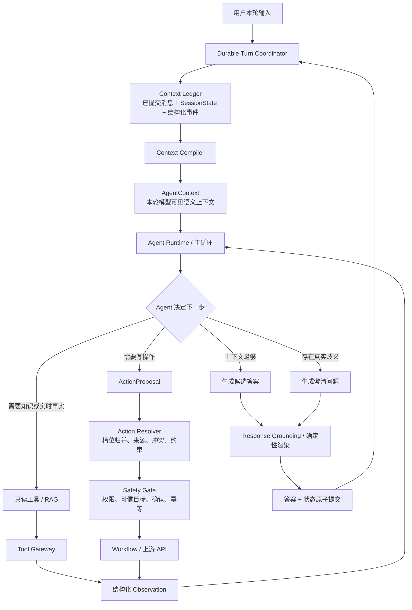

# Agent 中心化与上下文全链路收敛执行规格

> 状态：Ready for implementation
>
> 实施基线：`origin/main@15f2cc38`（PR #454 已合并）
>
> 替代未合并规格：`codex/routing-convergence-spec` 上的 `2026-07-14-routing-hardcoding-convergence-spec.md`
>
> 日期：2026-07-15

## 1. 决策摘要

PR #454 已解决“上下文能否可靠保存、恢复、传输和提交”的主要问题，但当前运行时仍由 Router、ContextDecision、直接 handler、ReAct Agent 和 Workflow 分别承担一部分语义判断。上下文虽然存在，仍可能在进入 Agent 之前被业务旁路截断，或者在写操作补参时被另一套关键词和正则重新解释。

后续不再建设 `Router -> ContextDecision -> Slot Kernel -> Agent` 流水线。目标改为：

1. **Agent Runtime 是唯一语义决策中心。** 它读取本轮可用的最完整语义上下文，决定直接回答、RAG、只读查询、澄清或提出写操作。
2. **不再保留独立的 Router LLM 与 ContextDecision LLM。** 意图、任务关系、工具选择和参数候选由同一次 Agent 推理完成。
3. **写操作仍是确定性执行。** Agent 只能提出结构化动作；Action Resolver 归并参数，Gate 校验权限、确认和幂等，Workflow 只消费最终执行合同。
4. **直接 handler 不再是业务终点。** 有价值的确定性查询、组合查询和渲染能力改造成 Agent 可调用的工具或结果渲染器。
5. **只保留真正的前置硬门。** 认证失败、协议错误、明确安全策略和确认协议可以在模型前终止；业务解析失败、信息不足、路由不确定不能零 LLM 结束本轮。
6. **不新建第三套持久上下文。** 已提交消息、SessionState、durable turn、action journal 继续是权威状态；新的 Context Compiler 只生成每轮只读视图。

完成后，用户无论输入完整问题、“粘贴呢”、纠正上一轮参数、选择列表中的对象，还是继续未完成的写操作，主 Agent 都会先看到足够的相关上下文。系统规则可以限制它执行什么，但不能让它在不知情的情况下回答。

## 2. 当前基线与边界

### 2.1 PR #454 已提供的地基

以下能力已经进入 `main`，本计划只复用，不重复实现：

- 持久轮次、稳定 Turn ID、跨副本会话执行权；
- 答案、消息、SessionState 的提交边界；
- WebSocket 断线恢复、事件重放和前端 `TurnNotSaved` 协议；
- action journal、确认接管、写操作防重放和不确定结果保护；
- `TurnContextView`、结构化长期记忆、已验证知识记忆；
- Agentic RAG、知识答案语义核验和一次修复；
- 公共凭证识别与清理；
- 工具范围默认只读、写工具仍受确认和 journal 保护。

旧 PR #441–#452 不再逐个合并。它们的有效能力应以 #454 和本规格为准；完成一次提交级差异核对后，在旧 PR 中注明替代关系并关闭，避免以后误重放旧实现。

### 2.2 当前仍存在的结构性问题

基于 `main@15f2cc38`，至少存在以下重复决策：

- `internal/intent` Router 先输出意图和部分槽位；
- `internal/engine/context_decision_layer.go` 再调用一次 LLM 判断继续、清除、选择、追问和槽位更新；
- `internal/engine/engine.go` 在 Agent 前执行多个直接业务分支；
- `internal/engine/deterministic_targets.go` 再用关键词推断生命周期动作和写操作参数；
- `internal/workflow/missing_slots.go` 为 10 个工作流分别解析补参、组参和拼追问；
- `DispatchSpec` 是统一读取界面，但执行方式、工具范围和 Skill 仍来自多个旧作者源；
- 一部分 handler 解析失败或要求澄清时，仍可能在没有主 Agent 判断的情况下终止。

这些代码并不全部是错误。问题在于它们都可能决定“用户想做什么”，并且读取的上下文范围不同。

### 2.3 非目标

本计划不做以下事情：

- 不让模型直接调用不受保护的写 API；
- 不把数据库行、密钥、权限内部状态和无限历史全部塞进 Prompt；
- 不删除资源 ID、IP、时间、单位和协议字段的严格格式校验；
- 不用另一份更大的关键词表或 YAML 替换现有补丁；
- 不追求所有回答必须调用 RAG；已有可靠上下文足够时允许直接回答；
- 不把确定性表格、库存、价格和实例状态改成模型自由编造；
- 不在本轮重做 #454 的存储、租约、提交和 WebSocket 协议。

## 3. 目标架构



### 3.1 上下文拥有关系

“Agent 拥有最多上下文”指模型可见的语义上下文，而不是系统所有内部数据。

| 组件 | 可以读取 | 不应读取或决定 |
|---|---|---|
| Context Ledger | 完整已提交事件、消息、状态、版本和执行记录 | 不做语义判断 |
| Context Compiler | 本轮需要的历史、任务、实体、证据、工具观察和连续性通知 | 不决定意图，不授权执行 |
| Agent Runtime | 最丰富的模型可见语义上下文和当前可用工具 | 不绕过 Gate，不直接提交写 API |
| Action Resolver | ActionProposal、相关已确认值、可信实体、操作 schema | 不读取整段聊天重新猜动作 |
| Safety Gate | ResolvedAction、身份、权限、确认和 action journal | 不修改用户语义，不补槽位 |
| Workflow | 最终 ExecutionContract 和上游依赖 | 不读取聊天历史，不解析自然语言 |
| Renderer / Grounding | 候选答案、证据包和展示合同 | 不获得写操作权限，不把用户原话当事实 |

### 3.2 唯一语义循环

主循环遵循同一形状：

```text
compile context
  -> model step
  -> final answer | read tool call | action proposal | clarification
  -> validate/execute if needed
  -> append structured observation
  -> next model step
  -> commit final answer and state
```

不得在主循环前再调用一个 Router LLM 或 ContextDecision LLM。允许保留的前置逻辑只有：

- 身份、会话和协议校验；
- 明确的越权、越狱、敏感信息和法律/产品硬策略；
- durable turn 接管、取消和确认协议；
- 请求体大小、速率和资源配额等系统保护。

这些前置逻辑不能清空任务，也不能因为业务信息不足而生成最终业务回答。

### 3.3 不依赖 Router 的工具选择

取消语义 Router 后，工具暴露不能退化成“把全部写工具直接交给模型”。目标采用三层能力发现：

1. 主 Agent 固定拥有少量安全核心能力：知识检索、能力搜索、读取当前任务、提出写操作；
2. Capability Registry 根据账号权限、部署环境和后端实际可用性过滤能力，不根据一句话预判用户意图；
3. 当具体工具较多时，Agent 先调用只读的 capability search/skill loading，再在下一步获得所需工具 schema。

写能力在模型侧只能产生 `ActionProposal`，不能直接触发上游副作用。真正执行仍由 Resolver、Gate、确认和 action journal 控制。

Agent 选择了只读工具以后，如果工具返回完整、可验证且已有确定性 Renderer 的结果，Runtime 可以直接提交该渲染结果，不必为改写文案再调用一次模型。这个优化发生在 Agent 已经结合上下文完成选择之后，不属于模型前旁路。

## 4. 核心运行时契约

以下类型描述责任边界，字段名可以在实现时调整，但语义不得退化。

### 4.1 `AgentContext`

```go
type AgentContext struct {
    TurnID              string
    CurrentUserMessage  string
    RecentConversation  []ConversationPair
    ConversationDigest  ConversationDigest
    ActiveTask           *TaskSnapshot
    PendingConfirmation *PendingActionSummary
    SelectedEntities     []EntityBinding
    RecentObservations   []ToolObservation
    VerifiedKnowledge    []VerifiedKnowledgeTurn
    ContinuityNotices    []ContinuityNotice
    AvailableTools       []ToolDescriptor
}
```

约束：

- 从已提交状态生成，每轮只构建一次；
- 当前未回答的用户消息只出现一次；
- 工具观察必须结构化、有来源、有时间和完整/截断标志；
- 实时价格、库存、状态和监控不能从过期观察恢复为当前事实；
- 敏感值在进入模型前清理；
- 长历史通过结构化任务、决定、约束、实体和带原文出处的摘要压缩；
- Context Compiler 可以裁剪相关性，但必须留下裁剪原因和可观测字段，不能静默丢失活动任务。

### 4.2 `AgentStep`

主模型每步只产生以下语义之一：

```go
type AgentStep struct {
    FinalAnswer   *AnswerDraft
    ReadToolCalls []ReadToolCall
    Action        *ActionProposal
    Clarification *ClarificationDraft
}
```

协议要求：

- 同一步不得同时提交最终答案和写操作；
- 有工具调用时，结果必须作为 Observation 回到 Agent；
- Agent 可以基于可靠历史不调用 RAG；
- 需要新事实时，RAG query 必须由 Agent 根据完整上下文组织为独立可理解的问题；
- 没有足够证据时可以说明限制，但不能把“守卫拒绝”伪装为“知识库没有资料”。

实现优先复用现有 OpenAI tool call 机制，不另造第二种模型协议。`AgentStep` 可以是运行时对 assistant message/tool calls 的内部投影。

### 4.3 `ActionProposal`

```go
type ActionProposal struct {
    Operation  OperationID
    TargetRefs []EntityRef
    Candidates []SlotCandidate
    UserVisibleSummary string
}

type SlotCandidate struct {
    Key        SlotKey
    RawValue   any
    Quote      string
    Source     CandidateSource
}
```

Agent 可以结合完整上下文填充写操作，但候选值不等于执行授权。

硬约束：

- `Quote` 必须能定位到本轮用户输入、已确认状态或结构化工具观察；
- 模型自报的置信度不参与状态清除、权限升级或写操作授权；
- 模型生成的实例名、ID 和容量不能因为“看起来合理”就升级为可信事实；
- 旧任务值只能在 TaskSnapshot 明确未完成、未过期且本轮没有冲突时继承；
- 多个有效候选必须保留歧义，不得静默选择第一个；
- 用户纠正后的新值覆盖旧候选，但不能覆盖其他写者已经提交的状态。

### 4.4 `ResolvedAction`

```go
type ResolvedAction struct {
    Operation      OperationID
    Target         TrustedEntity
    Slots          map[SlotKey]ResolvedSlot
    Missing        []SlotKey
    Ambiguities    []SlotConflict
    Violations     []ConstraintViolation
    Confirmation   ConfirmationRequirement
    IdempotencyKey string
}
```

Action Resolver 只做：

- schema 校验和 canonical key 归一化；
- 单位、枚举、资源引用、时间等通用类型转换；
- 当前候选、已确认值和可信实体的确定性归并；
- 必填项、跨字段约束和冲突检查；
- 输出结构化缺参或歧义。

Action Resolver 不做：

- 在整句自然语言中扫描第一个 `数字+G`；
- 用关键词重新推断动作；
- 根据 Prompt 文案猜测用户意图；
- 拼接最终对用户话术；
- 调用上游写接口。

### 4.5 `OperationSpec`

每个写操作声明：

- 操作 ID、对应 Workflow 和上游动作；
- 目标资源类型；
- 必填、可选和敏感槽位；
- 槽位类型、单位、局部别名和跨字段约束；
- 槽位到 Workflow 参数的绑定；
- 确认等级和成功后的缓存失效范围。

“普通槽位只能增加声明”不是绝对规则。允许新增共享转换器和操作专属验证器，但必须满足：

1. 转换器处理一种可复用数据类型，而不是一个句式；
2. 专属验证器只校验结构化值或跨字段业务规则，不扫描原始整句；
3. 别名可以按操作/领域局部生效，不要求全局唯一；
4. 新实现有来源、边界和删除旧实现的测试。

## 5. 组件与代码迁移映射

| 当前实现 | 目标位置 | 处理 |
|---|---|---|
| `TurnContextView` | `AgentContext` / Context Compiler | 扩展并成为主 Agent 的统一输入，不新建持久状态 |
| `e.messages` | Agent 模型历史 | 保留为原始已提交对话投影，受 Context Compiler 管理 |
| Router LLM | 主 Agent 首次模型 step | 删除独立调用和独立意图裁决 |
| `ContextDecisionLayer` | 主 Agent 对任务关系的判断 | 删除第二次 LLM；结构化任务变化由 Agent 输出、State Reducer 落地 |
| `DispatchSpec` | Capability Registry | 保留思想，改成工具能力、安全级别和回答合同的唯一作者源 |
| 直接 handler | Read Tool / deterministic renderer | 转为 Agent 可调用能力；不再自行终止上下文相关本轮 |
| `taskSlotSpecs` | OperationSpec + Action Resolver | 一次性迁移后删除 |
| `inferLifecycleAction` | Agent ActionProposal | 退出生产决策；只可短期影子比较 |
| `createDiskSizeFromUserText` 等 | 候选片段 + 通用 Codec | 删除整句盲扫 |
| `SafeToolExecutor` | Tool Gateway / Safety Gate | 保留并收窄为唯一工具执行边界 |
| action journal | Safety Gate / durable commit | 原样复用，不另建幂等机制 |
| Workflow | typed executor | 只接受 ExecutionContract，不读用户原文 |
| Grounded renderer | Response Gateway | 保留证据边界，减少重复 Prompt 和自由改写 |

建议新增包：

```text
internal/agentruntime/   主循环、AgentStep 和 Observation
internal/agentcontext/   Context Compiler 与模型可见视图
internal/capability/     工具、操作、回答合同的唯一目录
internal/action/         ActionProposal、Slot Kernel、ResolvedAction、State Reducer
```

现有 `workflow`、`tools`、`turncoord` 和 `store` 保持各自执行、保护和持久化职责。迁移早期可以先在 `internal/engine` 内建立接口，验证后再移动文件，避免第一批 PR 只有大规模改名。

## 6. 分阶段实施计划

所有实现分支都从当时最新的 `origin/main` 创建，不再叠在 #441–#452 或未合并的收敛规格分支上。阶段可以分 PR 合并，但同一时刻只能有一条生产语义路径拥有最终决定权。

### P0：冻结边界与建立可删除清单

目标：在重构期间阻止新的语义补丁继续增长。

交付：

- 将本规格合并到 `main`；
- 标记旧 `routing-hardcoding-convergence-spec` 被本文替代；
- 盘点所有模型前终止出口，分类为 `protocol`、`security`、`confirmation`、`business_direct`、`parse_failure`；
- 盘点 Router、ContextDecision、handler、engine 和 workflow 中所有动作/槽位作者源；
- 为每个旧入口记录目标替代组件和删除阶段；
- 收敛扫描器增加以下禁止项：新增业务关键词动作判断、整句参数正则、第二个上下文 LLM、工作流专属补参函数。

门禁：

- 清单覆盖所有生产入口，不以搜索到的固定数量作为长期常量；
- 新增任何业务语义规则必须显式失败；
- 不改变运行行为。

### P1：建立 `AgentRuntime` 接缝，不改变生产选择

目标：把现有 ReAct 循环从巨型 `engine.go` 中抽成可测试的中心运行时。

交付：

- 提取主循环、模型 step、tool observation 和 final answer 接口；
- 将现有 SearchKnowledge 和普通工具调用接入统一 Tool Gateway；
- 将 Prompt 组装改为接受 `AgentContext`；
- 现有 Router/handler 仍可决定是否进入 Agent，但一旦进入只能走新 Runtime；
- trace 记录每轮 AgentContext 的字段存在性、工具调用、观察和结束原因，不记录原始敏感内容。

门禁：

- 现有 Agentic RAG、诊断和普通 ReAct 回归结果不变；
- 删除调用点或绕开 Tool Gateway 时关键测试必须失败；
- 工具结果完整性、截断标志和 action journal 保护不退化。

### P2：Context Compiler 成为主 Agent 的唯一上下文入口

目标：让 Agent 看到完整、相关、可解释的上下文，同时不扩大执行权限。

交付：

- 将现有 `TurnContextView` 演进为 `AgentContext`；
- 合并最近完整问答、ConversationDigest、TaskSnapshot、可信实体、待确认动作、验证知识和当前轮工具观察；
- 为每类上下文定义 freshness、来源和最大尺寸；
- 主 Agent 不再由各意图临时拼装不同历史；
- Context Compiler 对裁剪、过期和未知 schema 产生明确 notice；
- 未知 schema 继续只读、不覆盖；损坏状态沿用 #454 的可见降级契约。

门禁：

- “粘贴呢”回放能看到上一轮完整问答；
- 待补参任务、用户选择、待确认动作在 AgentContext 中可见；
- 过期库存/价格不会作为当前事实注入；
- Context Compiler 的输出不携带密钥和原始无限工具 JSON；
- 热引擎、冷重建和跨副本接管编译出等价语义视图。

### P3：先建立 Capability Registry

目标：在移除 Router 前，先解决“没有意图标签以后如何安全给 Agent 工具”的依赖。

交付：

- 将 `DispatchSpec` 演进为 Capability Registry；
- 统一登记工具/操作名称、读写性质、风险、确认要求、结果类型、Agent 使用说明和 Renderer；
- 提供安全核心工具集和只读 capability search/skill loading；
- 工具暴露由账号权限、部署环境和后端可用性过滤，不由另一个语义模型预判；
- 未知或空配置默认无写权限；
- 先生成现有 `DispatchSpec` 所需投影，保持当前行为。

门禁：

- Registry 与现有工具、SafeToolExecutor policy、Workflow 注册和回答合同一致；
- 删除 Registry 接线时契约测试必须失败；
- 新增能力不需要在多个 switch 重复登记同一风险和权限事实；
- 此阶段不改变生产选择。

### P4：将业务直接出口封装为 Agent 工具

目标：在切换中心决策前，先让 Agent 拥有现有 handler 的确定性能力。

交付：

- 将资源查询、监控、价格、库存、规格、镜像等 handler 封装成只读 capability；
- 保留可靠的组合查询、过滤和确定性数据渲染；
- capability 返回结构化 Observation/EvidenceEnvelope；
- 缺参数、无匹配、registry 不完整和工具失败均使用结构化结果；
- 确定性 Renderer 标注结果是否可以在 Agent 已选择工具后直接提交；
- 当前生产入口暂不切换，仅验证 Agent 路径可以调用同一能力。

门禁：

- 新工具与当前 handler 对同一输入产生同一事实包；
- `CanAssertAbsence=false` 时不能断言资源不存在；
- 工具失败不能伪装成用户缺参数；
- 无工具获得绕过 EvidenceEnvelope 的第二条返回路径。

### P5：建立写操作 `ActionProposal -> Resolver -> Gate -> Workflow` 影子链

目标：在移除旧语义层前，先让新 Agent 写路径具备完整安全能力。

交付：

- 建立 ActionProposal、SlotCandidate、ResolvedAction 和 OperationSpec；
- 一次性盘点并声明全部现有写 Workflow；
- 建立共享 SlotCodec：资源引用、容量、整数、枚举、时间、受约束文本、敏感文本；
- 允许局部别名和操作专属结构化验证器；
- Agent 提案进入影子 Resolver，与现有参数比较，但不调用上游写 API；
- 确认卡生成、可信目标校验和 ExecutionContract 在影子环境完成；
- 现有 SafeToolExecutor、权限和 action journal 被定义为唯一 Gate。

门禁：

- 所有写 Workflow 100% 有 OperationSpec；
- 候选值都能说明来源；
- `pytest` 不会因为实例名为 `test`、`host` 或 `a` 而绑定机器；
- 资源 ID 中的 `8g` 不会抢走用户明确的 `30GB`；
- 多目标、多动作、多容量和纠正场景不会静默选择；
- 影子路径不具备真实写权限。

### P6a：只读和问答流量切到中心 Agent

目标：先消除非写业务的 Router/ContextDecision/handler 终点，不扩大写操作风险。

交付：

- 普通知识、诊断、资源、监控、价格、库存、规格和镜像轮次统一进入 Agent Runtime；
- Agent 可直接输出 read tool call、clarification 或 final answer；
- 活动任务的继续、切换、取消和纠正由 Agent 输出结构化 task delta；
- State Reducer 只验证并应用 task delta；
- Router 与 ContextDecision 对这些轮次变为 observe-only，不再修改状态和回复；
- 业务 handler 不再是这些轮次的模型前终点。

门禁：

- 每轮可以有多次 Agent tool step，但只有一条主语义链，不再串联 Router LLM + ContextDecision LLM + Agent LLM；
- 除 protocol/security/confirmation 外，只读业务不得零主模型调用结束；
- 新任务不会被旧任务劫持，继续任务不会因低置信路由被删除；
- 对上下文充分的跟进问题不要求用户重复已有信息；
- 真实记录回放通过后才能进入 P6b。

### P6b：写操作切到中心 Agent

目标：Agent 使用完整上下文填充 Workflow，同时保持确定性执行保护。

交付：

- 所有写操作从 Agent ActionProposal 进入 Resolver；
- 确认卡只从 ResolvedAction 生成；
- Workflow 只接受最终 ExecutionContract；
- 没有可信目标、确认、权限或 journal 时拒绝执行；
- Router 和 ContextDecision 对写轮次也变为 observe-only；
- 工作流切换由 Agent 明确提出，Resolver 检测与活动任务冲突。

门禁：

- 无确认卡、无可信目标或 CAS/journal 冲突时绝不执行；
- crash/takeover 重放不会重新运行非确定性模型去占用旧位置槽位；
- 写操作上游请求字段与契约一致；
- 真实创建、生命周期和扩容代表操作通过并完成清理。

### P7：删除旧语义路径并完成 Prompt 去重

目标：结束新旧语义系统并存。

同一删除阶段完成：

- 删除独立 Router LLM 的生产裁决和 `llmContextDecisionLayer`；
- 删除 ContextDecision Prompt、旧槽位字段、镜像和缓存；
- 删除 `taskSlotSpecs`、`parseUpdates`、工作流专属 `clarify` 和整句补参正则；
- 删除 `inferLifecycleAction` 的生产职责；
- 删除 `createDiskSizeFromUserText`、CFS/resize 等重复整句参数提取；
- 删除 Workflow 读取原始用户文本的入口；
- 删除 `PlannedExecutionPathForIntent`、`IntentToolSubset`、Skill switch 的重复作者事实；
- Prompt 只保留身份、边界、工具合同和少量高价值示例，知识策略只出现一次；
- 保留严格实体格式、值校验、权限、确认、安全和上游协议校验。

门禁：

- 旧入口在生产代码中为零；
- observe-only 最多存在两个发布周期，删除提交不得无限延期；
- 新增普通操作只需要 OperationSpec、必要的结构化验证器和测试；
- Prompt section ID 唯一；
- 真实记录行为没有上下文回归。

### P8：响应出口与状态归并收口

目标：正确答案不会被错误守卫删除，错误动作也不会因语言自然而被放行。

交付：

- final answer 统一经过 Response Gateway；
- 知识答案继续使用 #454 的证据语义核验；
- 实例表、价格、库存、状态等结构化事实优先确定性渲染；
- State Reducer 只从结构化 Agent task delta、工具 Observation 和 Workflow 结果更新状态；
- 普通失败、澄清和建议由 Agent 自然表达；字节固定话术仅用于协议和明确安全要求；
- 成功答案与状态仍由 durable turn 原子提交。

门禁：

- 有有效证据时不能谎称“知识库未覆盖”；
- 带合法引用但内容无据的答案不能通过；
- 用户原话不能作为事实证据洗白假前提；
- 回答已发送但状态未保存的情况仍必须表现为 `TurnNotSaved`，不能假成功。

### P9：文档、旧 PR 收尾和上线

交付：

- 确认 observe-only、旧 feature flags 和过渡 adapter 已删除；
- 更新 ADR、运行架构、工具开发指南、Workflow 开发指南和故障排查文档；
- 关闭被 #454 和本计划替代的旧 PR；
- 完成后重新运行收敛扫描，记录删除量而非把当前数量写成永久目标；
- 采用按能力分组的灰度开关，仅允许“整组使用新 Runtime”或“整组回到上一个完整版本”，禁止混合新理解层与旧执行层。

完成门：见第 8 节。

## 7. 精简且真实的验证方案

本计划不建设大规模主观 LLM eval。验证分为确定性契约、真实记录回放和少量真实端到端三层。

### 7.1 确定性契约测试

必须覆盖：

- Context Compiler 的来源、过期、裁剪、热冷一致和敏感信息边界；
- Tool Gateway 的只读/写权限；
- Action Resolver 的类型、单位、冲突、缺参和来源；
- Gate 的可信目标、确认、幂等、journal 和 CAS；
- Workflow 的上游参数；
- Response Gateway 的证据和确定性渲染；
- crash、takeover、retry 和 confirmation slot 的恢复行为。

高风险门必须做一次反向变异：删除调用点、移到错误顺序或恢复旧行为时，测试应以业务断言失败，而不是编译失败。

### 7.2 真实记录最小回放集

从已有脱敏生产记录固定一个小而稳定的集合，不人工编造同义句海洋。至少包含：

1. “粘贴呢”及其完整上一轮；
2. 已检索到证据但旧守卫拒答的知识轮次；
3. 用户明确输入实例 ID 后下一轮继续诊断；
4. 从实例列表按序号选择；
5. 未完成工作流补一个参数；
6. 用户纠正上一轮参数；
7. 用户放弃旧任务并开始新任务；
8. 旧任务不应劫持纯硬件创建；
9. registry 不完整时的资源不存在判断；
10. 第一轮本来就没有上下文的合法澄清。

每条只判定可观察结果：Agent 实际收到哪些上下文、调用了什么工具、是否执行写动作、最终答案是否使用已有信息。不得仅凭模型自评或通用 judge 分数放行。

### 7.3 写操作安全回归

除真实记录外，保留少量针对安全边界的构造样本：

- 实例名 `test`、`host`、`a` 与输入 `pytest`；
- 资源 ID 含 `8g/30g/48g`，同时要求另一容量；
- 同一句两个实例、两个动作、两个容量；
- 引用旧动作、否定动作、咨询动作和真正执行动作；
- 模型提案目标未出现在用户文本、可信选择或结构化观察中；
- 已确认 action 与重放 action 参数不同。

### 7.4 真实系统验收

发布前执行：

- `go test ./... -count=1`；
- PostgreSQL durable turn、action journal、恢复与竞争测试；
- `go test -race` 覆盖 entity、agent runtime 和 turn coordinator；
- 真实 WebSocket：双标签页、断线恢复、刷新、重复发送、跨副本确认；
- 测试账号真实只读查询；
- 测试账号各选一个代表性写操作：创建、停止/启动、扩容，查询最终资源状态并清理；
- 前端与后端协议版本同步验收。

成功证据必须来自最终资源查询、durable turn 和 action journal，不能以聊天里出现“成功”作为成功。

## 8. 完成定义

以下条件全部满足才算上下文架构收敛完成：

1. 每个普通业务轮次都进入同一个 Agent Runtime；
2. AgentContext 是主 Agent 唯一模型可见上下文入口；
3. 不再存在独立 Router LLM 和 ContextDecision LLM；
4. 除协议、安全和确认外，没有零主模型调用的业务终止出口；
5. RAG、查询和写操作都由 Agent 基于同一上下文选择；
6. 写操作只能经 `ActionProposal -> Resolver -> Gate -> Workflow`；
7. Workflow 不读取原始聊天文本；
8. `taskSlotSpecs`、动作关键词推断和整句参数正则退出生产路径；
9. Capability Registry 是工具能力、风险和回答合同的唯一作者源；
10. 状态只由结构化事件、Agent task delta 和执行结果更新；
11. #454 的 durable turn、WebSocket 恢复、确认和 journal 保护全部保留；
12. 真实记录最小回放集和真实系统验收通过；
13. 所有临时双路、影子比较和兼容开关有删除提交，生产不长期维护两套语义系统；
14. 旧 PR #441–#452 已核对并关闭，不再存在可被误合并的旧修复链。

## 9. PR 拆分与依赖

建议按以下顺序提交，每个 PR 都必须从已合并的前一阶段最新 `main` 开分支：

| PR | 内容 | 是否改变行为 | 主要删除 |
|---|---|---:|---|
| A | P0：规格、清单和新增补丁门禁 | 否 | 无 |
| B | P1：AgentRuntime 接缝 | 否 | engine 内重复循环 |
| C | P2：AgentContext / Context Compiler | 小 | 各路径临时上下文拼装 |
| D | P3：Capability Registry | 否 | 多个权限/风险作者源的第一批副本 |
| E | P4：只读 handler 工具适配 | 否 | 无，先建立等价能力 |
| F | P5：ActionProposal、Resolver、OperationSpec 影子 | 否 | 无，影子路径无写权限 |
| G | P6a：只读和问答切到中心 Agent | 是 | 非写业务的 Router/ContextDecision/直接终点职责 |
| H | P6b：写操作切到中心 Agent | 是 | 旧写操作语义入口 |
| I | P7：删除旧语义路径与 Prompt 去重 | 小 | taskSlotSpecs、动作/参数重复解析、独立语义 LLM |
| J | P8–P9：响应、状态、收尾和上线文档 | 小 | 临时双路、旧 flags、旧 PR 链 |

禁止把 G、H、I 合成一个不可审查的大 PR。也禁止先合入新的永久 adapter，再把删除留到没有负责人和截止时间的“后续优化”。行为切换 PR 必须在 PR 描述中列出精确回滚边界和下一份删除 PR。

## 10. 设计依据

该结构与主流通用 Agent Runtime 的共同形状一致：Agent 持有模型可见上下文，在中心循环内决定工具调用，工具输出作为观察返回；权限、hook 和持久化位于模型与执行边界，而不是由独立意图流水线替 Agent 决定。

- Pi：[`Agent`](https://github.com/badlogic/pi-mono/blob/dcfe36c79702ec240b146c45f167ab75ecddd205/packages/agent/src/agent.ts) 与 [`agent-loop`](https://github.com/badlogic/pi-mono/blob/dcfe36c79702ec240b146c45f167ab75ecddd205/packages/agent/src/agent-loop.ts)
- Codex：[`run_turn`](https://github.com/openai/codex/blob/e4711f2a3be8d6910df0e3ee956eb3a8330dbbf1/codex-rs/core/src/session/turn.rs)、[`TurnContext`](https://github.com/openai/codex/blob/e4711f2a3be8d6910df0e3ee956eb3a8330dbbf1/codex-rs/core/src/session/turn_context.rs) 与 [`tool registry`](https://github.com/openai/codex/blob/e4711f2a3be8d6910df0e3ee956eb3a8330dbbf1/codex-rs/core/src/tools/registry.rs)
- Claude Agent SDK：[`client`](https://github.com/anthropics/claude-agent-sdk-python/blob/57f67cd12cdb2b65cf0c2e56af4c9b3682bff57d/src/claude_agent_sdk/client.py) 与 [`tool hooks / permissions`](https://github.com/anthropics/claude-agent-sdk-python/blob/57f67cd12cdb2b65cf0c2e56af4c9b3682bff57d/src/claude_agent_sdk/types.py)
- OpenHands：[`agent step`](https://github.com/OpenHands/software-agent-sdk/blob/e2b852c59b3f7a96fe0decde8d762a1ad7f0bc16/openhands-sdk/openhands/sdk/agent/agent.py) 与 [`conversation loop`](https://github.com/OpenHands/software-agent-sdk/blob/e2b852c59b3f7a96fe0decde8d762a1ad7f0bc16/openhands-sdk/openhands/sdk/conversation/impl/local_conversation.py)

CompShare 与代码 Agent 的差异是生产写操作风险更高，因此本规格比通用 Agent 多保留了一层确定性的 Action Resolver、可信目标校验、确认和 action journal。它们约束执行，不替代 Agent 理解上下文。
