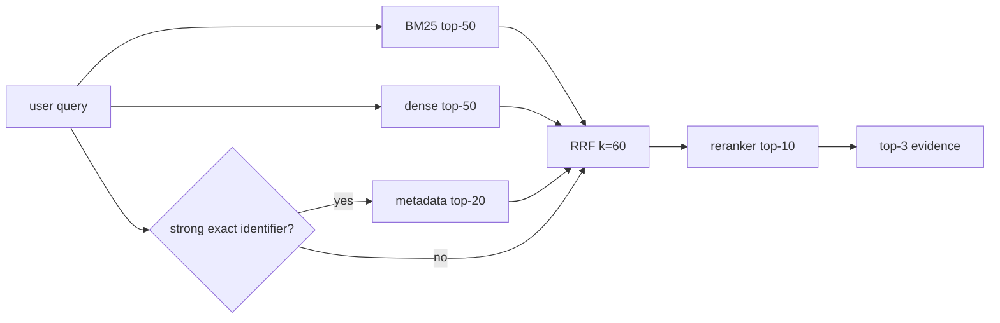
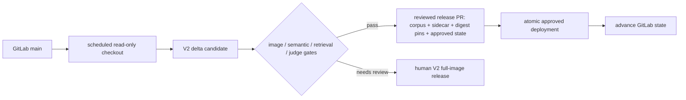

# RAG V2 metadata and GitLab incremental update contract

## Decision

The current V2 corpus does **not** need a full preprocessing rerun before we
add metadata retrieval or GitLab updates. Its existing JSONL rows already carry
`document_id`, `document_title`, `document_type`, `heading_path`, `source_refs`,
`chunk_role`, `evidence_kind`, and `v2_source_kind`. The prior runtime loader
silently ignored these fields; the runtime now retains them and builds an
in-memory exact-identifier index when it loads the corpus.

The three public FAQ exports remain frozen source snapshots. A GitLab delta
rebuilds only changed platform Markdown, retains every non-GitLab row, and lets
`refresh_embeddings.py` reuse vectors whose title, question patterns, and body
did not change. It is not a new source of truth for the operations-maintained
Feishu documents.

## Metadata contract

| Field | Purpose | Existing V2 rows | New GitLab delta rows |
| --- | --- | --- | --- |
| `document_id`, `document_title`, `document_type`, `heading_path` | Document hierarchy and section provenance | Present | Present |
| `source_refs`, `v2_source_kind` | Source ownership and selective replacement | Present | Present |
| `parent_id`, `chunk_ordinal` | Parent-child navigation and stable child ordering | Derived at runtime where absent | Written by V2 builder |
| `source_revision` | Git commit that produced a changed document | Not required | Target GitLab SHA |
| `exact_terms` | Bounded model/API/error-code/number identifiers | Derived from existing fields/body at load | Persisted for new chunks |

`exact_terms` is deliberately bounded (32 entries, 200 runes each). It is not
free-form tagging and must not contain customer, ticket, chat, or internal-only
data.

## Exact-query behavior

For a query containing a strong identifier such as `qwen3-reranker-8b`,
`A100`, `RTX 4090`, an API name, or an error code, the retriever builds a
bounded metadata candidate list (maximum 20 chunks) and adds it as a third RRF
input:



This is a soft metadata filter, not a hard gate: BM25 and dense candidates are
never discarded merely because metadata did not match. It protects recall when
the identifier is broad (`100GB`) or source metadata is incomplete. Retrieval
trace rows expose `metadata_rank` alongside `bm25_rank`, `dense_rank`, and
`fusion_rank` for later offline analysis.

HyDE is intentionally not enabled by this change. If it is introduced later,
its gate must run **after** exact-term detection and allow only short,
non-exact questions. A practical initial policy is: no identifier match, no
code/number/model pattern, and no more than 12 Chinese characters or 6 lexical
tokens. It should be shadow-evaluated against the real-query set before it can
call an embedding model in production.

## Parent-child and ANN scope

Parent-child mapping is worth adding now because it is cheap provenance: a
retrieved child can later expand to its document/section siblings without
changing chunk text or embeddings. The V2 delta fields provide that mapping;
no parent document body is duplicated into the runtime corpus yet.

ANN is not a current bottleneck. The deployed merged corpus is roughly 1,744
chunks (544 platform + 1,200 external), and qwen3 RRF deliberately performs a
full active-corpus dense scan before taking top-50. Replacing it with ANN now
would add index lifecycle, recall-tuning, and deployment complexity without a
measured latency problem. Revisit it only after the active set is materially
larger (for example tens of thousands of chunks) or trace p95/p99 shows dense
scan—not embedding/reranker network time—is the bottleneck. Any future ANN
index must be release-versioned and validated against the same exact corpus
digest as its embedding sidecar.

## GitLab delta builder

`python -m scripts.rag_v2.gitlab_sync` accepts a locally checked-out
`compshare-docs` revision plus the currently approved V2 platform corpus. It
uses `git diff --name-status --find-renames` and handles:

- A: build only the added eligible Markdown document.
- M: replace chunks whose `source_refs` point at that document.
- D: remove chunks whose `source_refs` point at the deleted document.
- R: remove old-path chunks and build the new-path document.

Only Markdown beneath `pages/` or `public/action_md/` is automatically
eligible. A changed non-Markdown asset, a non-decorative image in a changed
Markdown file, a missing changed file, or a document that stops being
collectable produces `review_required` and **no candidate corpus**. Such a
change must use the regular V2 image/VL release path instead.

Initial baseline is the GitLab source lock in
`deploy/kb/v2/release_manifest.json` (currently
`8a81268e3d275d4767d045554680e7c5ddf82a9d`). The baseline state must advance
only after the matching corpus is approved and promoted. The delta builder
therefore treats `--state-file` as read-only and writes a state *proposal* into
the candidate directory; it never moves the approved cursor on its own.

Example candidate command:

```bash
git -C /srv/rag-sources/compshare-docs fetch --prune origin main
git -C /srv/rag-sources/compshare-docs checkout --detach origin/main

python -m scripts.rag_v2.gitlab_sync \
  --docs-repo /srv/rag-sources/compshare-docs \
  --base-corpus deploy/kb/v2/stage2b_v2.jsonl \
  --state-file deploy/kb/v2/gitlab_sync_state.json \
  --out-dir /srv/rag-candidates/compshare-docs-$(date +%F) \
  --kb-version kb.platform.v2.$(date +%F).<short-git-sha> \
  --valid-from $(date +%F) \
  --env /etc/compshare-agent/rag.env
```

`--skip-semantic` is only for deterministic tests and diagnosis. An approved
candidate must run the same semantic splitter as a full V2 release.

## Scheduled release boundary

The production deployment machine may run a read-only checkout plus this
candidate builder, but it must not overwrite `deploy/kb/` directly. The Go
binary pins corpus and sidecar digests at compile time; a direct overwrite will
either fail boot or create an unreviewed data/runtime mismatch.



The approved release job must:

1. Run `refresh_embeddings.py` with the previous corpus and sidecar so only
   changed chunk representations are embedded.
2. Run corpus validation, the real-query retrieval evaluation, and the release
   judge gates.
3. Update the V2 release manifest and the Go corpus/embedding digest constants
   in the same reviewed change.
4. Promote the validated bundle atomically, then copy the proposed state as the
   new approved `gitlab_sync_state.json`.

This makes retries safe: if any gate fails, the state still points at the last
released GitLab commit and the next scheduled candidate rebuild sees the same
delta instead of silently skipping it.
